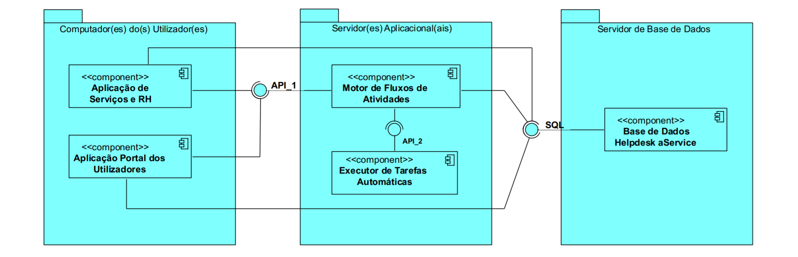

# README #

     _    _          _               _                _                        _____                         _               
    | |  | |        | |             | |              | |        /\            / ____|                       (_)              
    | |__| |   ___  | |  _ __     __| |   ___   ___  | | __    /  \     ___  | (___     ___   _ __  __   __  _    ___    ___
    |  __  |  / _ \ | | | '_ \   / _` |  / _ \ / __| | |/ /   / /\ \   / __|  \___ \   / _ \ | '__| \ \ / / | |  / __|  / _ \
    | |  | | |  __/ | | | |_) | | (_| | |  __/ \__ \ |   <   / ____ \  \__ \  ____) | |  __/ | |     \ V /  | | | (__  |  __/
    |_|  |_|  \___| |_| | .__/   \__,_|  \___| |___/ |_|\_\ /_/    \_\ |___/ |_____/   \___| |_|      \_/   |_|  \___|  \___|
                        | |                                                                                                  
                        |_|

(logo created with [kammerl ascii signature](https://www.kammerl.de/ascii/AsciiSignature.php))

## License and copyright ##

[MIT License](LICENSE)

##  System Overview ##

### Brief [Powerpoint presentation](docs/Presentation.pptx) of the project and initial development. ###

###  Also, check the [docs](docs/README.md) folder for the full documentation on the use cases developed so far. ###

## Bulding and Running the Application ##

Project configured to run locally.

All scrips necessary are in the [scripts](./scripts) folder. Use .sh or .bat files according to the operating system in use.

Deploy order:

    1. build-all/rebuild-all
    2. run-executorTarefas
    3. run-motorFluxo
    4. (optional) run-bootstrap (sample data)
    4. run-portalUtilizador and/or run-servicosERH

