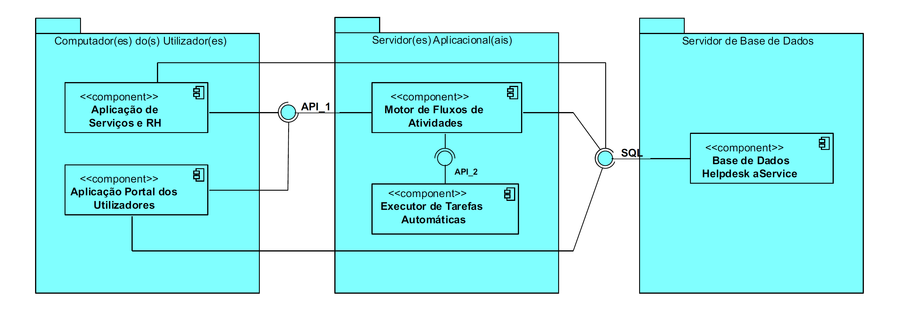
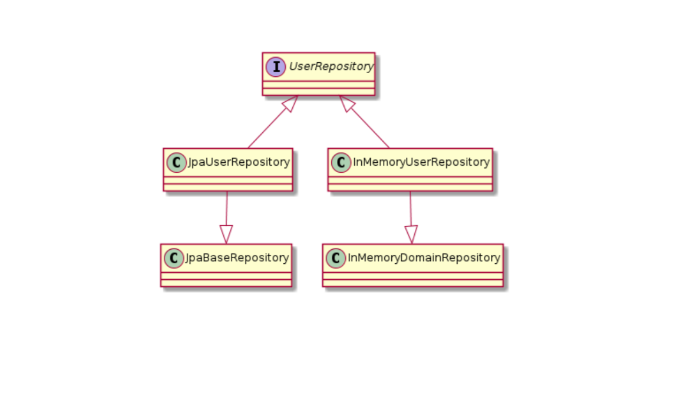
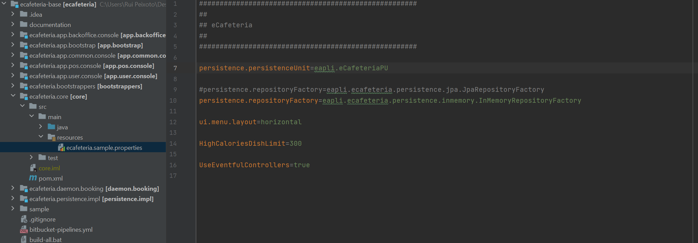
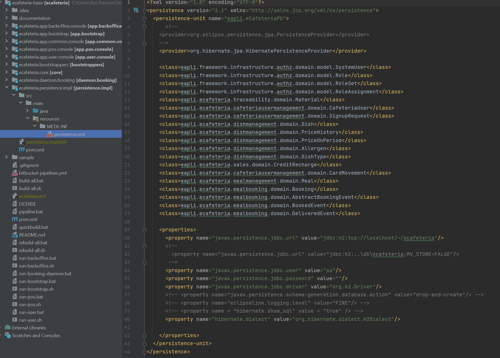
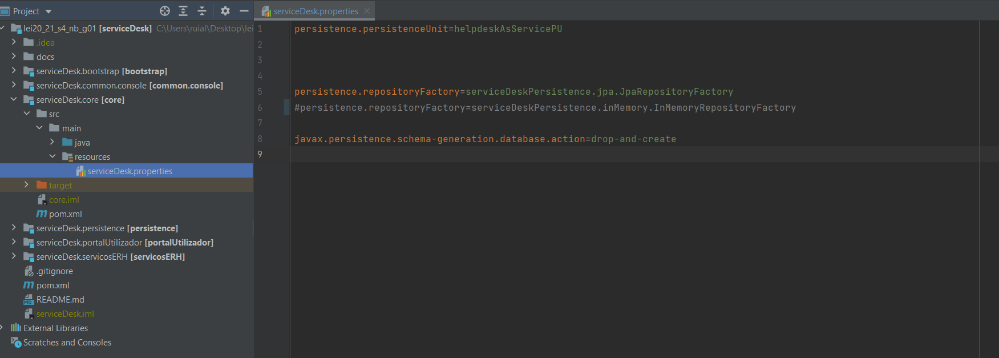
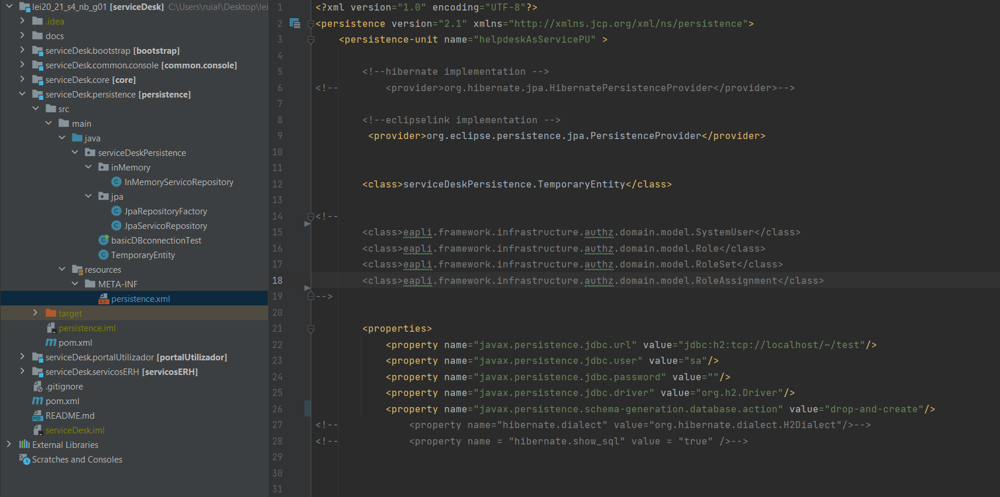

 US 1003 - Configurar a estrutura do projeto 
=======================================

# 1. Requisitos #

 **Como Gestor de Projeto, eu pretendo que a equipa proceda à configuração da estrutura do projeto para facilitar / acelerar o desenvolvimento das próximas user stories.**
 
* *Critérios de aceitação*:  "Por configuração, o sistema deve suportar que a persistência de dados seja feita em memória ou numa base de dados relacional (RDB). Deve possuir a capacidade de inicializar alguns dados." 

A interpretação feita deste requisito foi no sentido de tomar as decisões subjacentes, tanto à escolha e organização das aplicações a criar, como à base de dados e SGBDR a utilizar.

 

# 2. Análise

Para as decisões tomadas baseamo-nos primeiramente no sistema protótipo, e respetivas aplicações preconizadas, que nos foi fornecido juntamente com o caderno de encargos:

Citando o caderno de encargos:

"De acordo com o representado, o sistema protótipo é constituído por:
• Uma base de dados relacional, denominada “Base de Dados Helpdesk aService”, responsável pela
persistência centralizada de todos os dados/informação manuseados/geridos pelo sistema e pelo
respetivo acesso aos mesmos.

• Uma aplicação consola, denominada “Aplicação de Serviços e RH”, orientada à realização das
funcionalidades associadas tanto ao (i) Gestor de Serviços de Helpdesk como ao (ii) Responsável
de Recursos Humanos. Esta aplicação será instalada apenas no computador pessoal destes
utilizadores.

• Uma outra aplicação consola, denominada **“Aplicação Portal dos Utilizadores”**, orientada à
realização das funcionalidades que podem ser realizadas pelos diversos colaboradores da
organização (e.g. solicitar um serviço, realizar uma tarefa no âmbito da satisfação de um pedido
em curso). Esta aplicação será instalada no computador pessoal de todos os utilizadores.

• Uma aplicação servidora, denominada “Motor de Fluxo de Atividades”, responsável por gerir o
progresso/avanço correto e atempado dos fluxos de atividades respeitantes aos pedidos em
curso. Tem ainda a responsabilidade de disponibilizar a pedido das aplicações do tipo consola
informação relativa aos dashboards dos utilizadores e informação estatística sobre o estado de
execução dos pedidos em curso.

• Uma aplicação servidora, denominada “Executor de Tarefas Automáticas”, responsável pela
execução, em simultâneo, das tarefas automáticas que lhe vão sendo requeridas pelo “Motor de
Fluxo de Atividades”.
Pretende-se ainda que o “Executor de Tarefas Automáticas” possa ser instalado num servidor distinto
daquele onde se instalará o “Motor de Fluxo de Atividades”. E, no limite, possam existir múltiplas
instâncias ativas do “Executor de Tarefas Automáticas” dispersas por vários servidores de modo a que
o “Motor de Fluxo de Atividades” possa distribuir/delegar a execução de tarefas automáticas pelas
diversas instâncias com o intuito de garantir a sua rápida e atempada execução.

A interação entre as diversas aplicações, representadas através da disponibilização e consumo de API
(i.e., “API_1” e “API_2”) deverá realizar-se de acordo com o protocolo de comunicação especificado
no documento denominado “Parte III – Protocolo de Comunicação”.

Por fim, salienta-se que o desenvolvimento destas aplicações não invalida de maneira nenhuma a
existência de um conjunto de componentes/módulos de software que sejam comuns/partilhados
entre as mesmas. Pelo contrário, tal é incentivado de modo a promover uma fácil, rápida, eficiente e
eficaz manutenção, evolução e atualização do sistema como um todo e, em particular, das regras de
negócio."

## 2.1. Divisão da aplicação ##

Optamos por uma separação da aplicação nos seguintes componentes:

1. serviceDesk.core
2. serviceDesk.common.console
3. serviceDesk.portalUltilizador
4. serviceDesk.servicosERH
5. serviceDesk.executorTarefas
6. serviceDesk.motorFluxos
7. serviceDesk.persistence
8. serviceDesk.bootstrap

Esta divisão foi feita baseada nos seguintes fatores:
* Garantir a existencia das diferentes aplicações preconizadas pelo cliente
* Diminuir a repetição de código e facilitar a manutenção e evolução do projeto
* Criar uma separação de conceitos e diminuir o acoplamento
* Facilitar o trabalho paralelo dos vários membros da equipa

## 2.2. Escolha de um Sistema de Gestão de Bases de Dados Relacionais (SGBDR) ##

Devido à sua baixa complexidade e à facilidade de configuração, optamos pela utilização do SGBDR *"H2"* face a outras opções como mySQL ou Oracle.
Esta opção foi tomada tendo em consideração a utilização de JPA na camada de persistência, o que nos permite uma fácil migraçao para um SGBDR mais competente assim que tal seja necessário.

## 2.3. Diferentes opções de persistencia ##

 As diferentes opções de persistência serão garantidas através de diferentes implementações presentes no componente serviceDesk.infrastructure.persistence.

 Inicialmente, estarão presentes uma implementação para persistência de dados em memória e uma implementação para persistência em base de dados relacional, utilizando a API JPA.

 A alternação entre as duas implementações pode ser facilmente executada através de uma modificação no ficheiro de configuração.
 
 Posteriormente, tendo em conta a utilização da API JPA, a implementação de / migração para diferentes Sistemas de Gestão de Bases de Dados Relacionais (SGBDR) como, por exemplo, MySQL, MS SQL Server e Oracle, pode ser realizada facilmente.
 
  

# 3. Design

 ## 3.1. Realização da Funcionalidade

 * Utilizando a framework.eapli fornecida podemos implementar repositórios tanto para persistência em memória como para persistencia em base de dados.

* Como mencionado num tópico anterior, a alteração entre uma ou outra implementação pode ser feita através da edição do ficheiro de propriedades:

* Quanto à utilização de diferentes SGBDRs, caso não seja utilizado um dialecto de SQL especifico de cada base de dados, a migração para outro SGBDR pode chegar a ser tão simples como alterar o *persistence unit* no ficheiro de propriedades visivel acima. A configuração de uma *persistence unit* (neste caso utilizando Hibernate) pode ser vista no exemplo abaixo, também referente ao projeto eCafeteria.
<!-- usar um exemplo da aplicação actual-->

 

<!--

## 3.2. Padrões Aplicados

*Nesta secção deve apresentar e explicar quais e como foram os padrões de design aplicados e as melhores práticas.

 

-->

# 4. Implementação

A implementação é em tudo identica ao visto anteriormente no projeto ecafeteria, como se pode verificar nos screenshots do nosso projeto.

 

<!--

# 5. Integração/Demonstração

 *Nesta secção a equipa deve descrever os esforços realizados no sentido de integrar a funcionalidade desenvolvida com as restantes funcionalidades do sistema.*

 -->

# 5. Observações

Perante a imaturidade do projeto é natural que este documento sofra várias alterações como o decorrer do desenvolvimento.

<!-- *Nesta secção sugere-se que a equipa apresente uma perspetiva critica sobre o trabalho desenvolvido apontando, por exemplo, outras alternativas e ou trabalhos futuros relacionados.* -->

