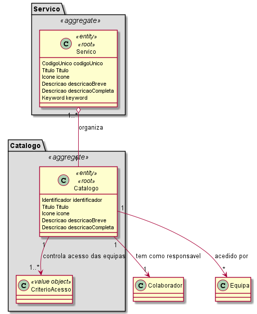
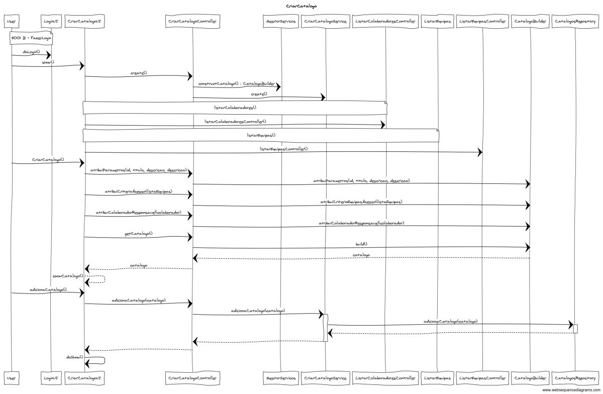
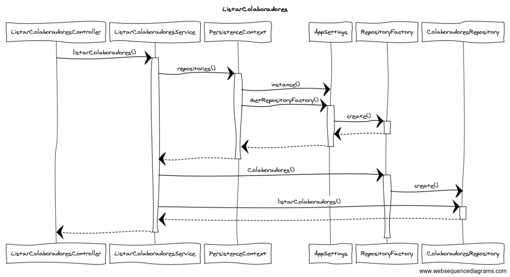

# 2001 - Criar Catálogo de Serviços
=======================================

# 1. Requisitos

Como Gestor de Serviços de Help desk (GSH) pretendo criar um novo catálogo de serviços.  
Um catálogo caracteriza-se por:

* Um identificador;
* Um título;
* Uma descrição breve;
* Uma descrição completa;
* Um ícone;
* Indicação do helpdesk.estruturaorganica.domain.colaborador responsável pela sua gestão;
* Especificação dos critérios de quem tem acesso aos serviços do catálogo (colaboradores a quem o serviço fica disponivel: uma ou mais equipas). De momento, os critérios de acesso podem-se restringir apenas à indicação de um conjunto de equipas de colaboradores;

        Nota: De momento, não é necessário suportar catálogos que disponibilizam outros catálogos.

# 2. Análise

Excerto do Modelo de Domínio relevante para o Caso de Uso  

Para realização deste caso de uso existiu a necessidade de alterar o sentido da agregação entre catálogo e serviço considerado no sprint 1, uma vez que durante a especificação do serviço é que é indicado qual o catálogo a que o mesmo pertence. 
A classe CriterioAcesso é composta, para já, por uma lista de equipas com acesso ao catálogo criado.

## 2.1. Fluxo de realização

Actor: Gestor de Serviços de Help desk (GSH)
  * Login   
  * Sistema apresenta lista de equipas
  * Sistema apresenta lista de colaboradores
  * Especifica os atributos do catálogo  
    * Identificador (manual - fórum) 
    * Título 
    * Descrição breve 
    * Descrição completa 
    * Ícone 
  * Seleciona helpdesk.estruturaorganica.domain.colaborador responsavel
  * Seleciona as equipas com acesso ao catálogo
  * Adiciona o catálogo

# 3. Design

O catálogo deve ser persistido, tendo sido assim considerada como entidade e como root do seu próprio agregado.  
Os atributos desta entidade têm regras especificas inerentes ao negócio, por este motivo, são promovidos a Value Objects do sistema. Assim em cada objecto serão especificas todas as regras e validações necesárias. 
Tendo em consideração que a classe Catalogo trata-se de um objeto complexo, uma vez que agrega a classe CriterioAcesso, em que esta define uma ou mais equipas com acesso ao catálogo em questão, adotou-se um padrão fábrica, mais em especifício o Builder.

Sequence Diagram - Criar Catalogo
  

Sequence Diagram - Listar Colaboradores
  

        O acesso ao repositório deverá ser realizado de acordo com o ilustrado no diagrama acima.
        O método a adotar para a listagem de equipas poderá ser realizado de forma similar à listagem de colaboradores.

## 3.1. Padrões Aplicados

* Repository -> Persistência das classes
* Builder -> Criar instância de Catalogo
* Single Responsibility Principle e Information Expert -> Classes de domínio
* Service -> Tratar informação do repositório
* Data Transfer Object -> Para apresentação dos objectos de dominio, de forma isolada do dominio em si, baixando o acoplamento.

## 3.2. Testes 

**Teste 1:** Verificar que não é possível criar uma instância da classe Catalago com valores nulos.

	@Test(expected = IllegalArgumentException.class)
		public void ensureNullIsNotAllowed() {
		Exemplo instance = new Exemplo(null, null);
	}

**Teste 2:** Caso nenhuma equipa tenha acesso, a instância de CriterioAcesso deve existir, mas não aglomera nenhuma equipa.

	@Test(expected = IllegalArgumentException.class)
		public void ensureNullIsNotAllowed() {
		Exemplo instance = new Exemplo(null, null);
	}

# 4. Observações

.
