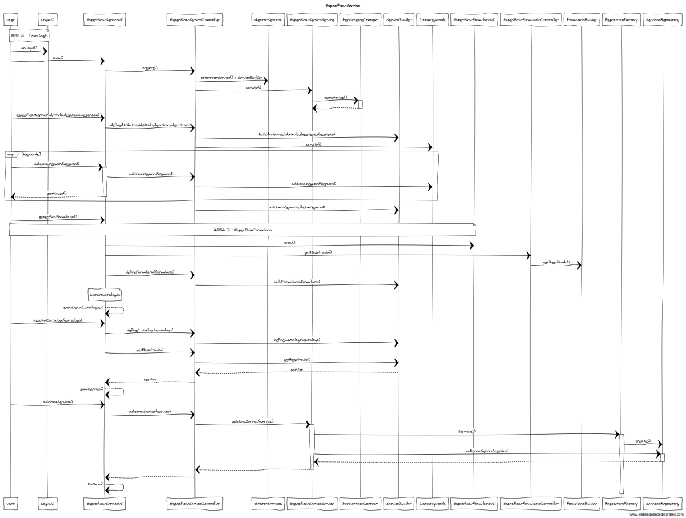
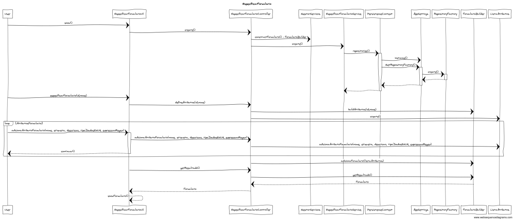

# 2002 - Especificar Servico
=======================================

# 1. Requisitos

Como GSH, eu pretendo proceder à especificação de um novo serviço, devendo o sistema permitir que a mesma fique incompleta e seja, posteriomente, retomada.
Um serviço possui:

* Um código único;
* Um título;
* Uma descrição breve;
* Uma descrição completa;
* Um ícone;
* Um conjunto de palavras-chave (keywords);
* O catálogo onde é disponibilizado; 
* Um formulário de solicitação do serviço;
* Requer feedback;

Cada formulário tem:

* Um identificador único no âmbito do serviço;
* Um nome;
* Um lista de atributos a solicitar ao helpdesk.estruturaorganica.domain.colaborador;

Um atributo caracteriza-se por:

* Um nome de variável;
* Uma etiqueta (label) de apresentação;
* Uma descrição de ajuda;
* Um tipo de dados base (e.g., numérico, texto, data, booleano, seleção de valores pré-definidos);
* Obrigatoriedade de preenchimento;
* Uma expressão regular que permita a sua validação local. 
* Um script que permita proceder à sua validação;

        Nota:
        Para persistir o serviço é apenas necessária a introdução do código e título (https://moodle.isep.ipp.pt/mod/forum/discuss.php?d=7772#p10147).
        O serviço só deve ficar disponivel para solicitação quando a sua especificação ficar completa e válida.
        Apenas informação base do serviço (código, descrição, catálogo onde será disponibilizado, formulários, requer feedback). 
        Exemplo de tipos de dados a considerar nos formulários: Inteiro, String, Bool, Data, Ficheiro, ListaDeValores (Enumerado).

# 2. Análise

Excerto do Modelo de Domínio relevante para o Caso de Uso  

Para realização deste caso de uso existiu a necessidade de alterar o sentido da agregação entre catálogo e serviço considerado no sprint 1, uma vez que durante a especificação do serviço é que é indicado qual o catálogo a que o mesmo pertence. 
Além disso, o modelo de domínio anterior não previa a ligação entre Feedback e Serviço no momento da especificação de serviço, associado ao facto de um serviço poder requerer feedback ou não. 
O servico passou a ter uma ListaKeywords, numa associaç
ao de 1 para 1 e este prevê a ligação para keyword numa associação de um para muitos.
Também o modelo de domínio não previa que a especificação do formulário pudesse ser interrompida juntamente com a especificação do serviço, por isso associou-se também um estado de especificação ao Formulário. Os atributos mínimos para persistir esta classe são o identificador e o nome. Alterou-se assim a cardinalidade entre formulário e atributo. 
Relativamente às outras regras de negócio, o modelo de domínio permite o seu cumprimento.

## 2.1. A ter em consideração

* Para se poderem disponbilizar serviços será necessário existir primeiro um catálogo onde o serviço se vai inserir. 
* Tendo em consideração a associação entre serviço e catálogo, para saber quais os serviços de cada catálogo será necessário percorrer todos os serviços. 
* Um serviço não poderá estar associado a catálogos distintos.
*  "No caderno de encargos consta o seguinte: "Os dados/informação a recolher no formulário (i) de solicitação do serviço e/ou (ii) no formulário de uma atividade manual. Cada formulário tem...".
Portanto, um serviço tem sempre UM formulário que é utilizado aquando de um pedido desse serviço. E, terá tantos mais formulários quantas as atividades manuais constantes no seu fluxo de atividade.
No âmbito da US2002 apenas é necessário garantir que é possível especificar um ou mais formulários." (https://moodle.isep.ipp.pt/mod/forum/discuss.php?d=7797)

## 2.2. Fluxo de realização

Actor: Gestor de Serviços de Help desk (GSH)
* Login  
* O utilizador especifica informação base (código, título, descrição, descrição, ícone)
* O sistema solicita as palavras-chave (keywords)
* O sistema apresenta uma lista de catálogos
* O utilizador seleciona o catálogo no qual o serviço se vai enquadrar 
* O utilizador especificar um formulário de solicitação do serviço:
  * O utilizador especifica identificador único no âmbito do serviço, nome
  * O utilizador preenche uma lista de atributos a solicitar ao helpdesk.estruturaorganica.domain.colaborador, para cada atributo preenche:
    * Nome de variável, etiqueta (label), descrição de ajuda
    * Escolhe um tipo de dados base
    * Define expressão regular que permita a sua validação local. 
    * Define um script que permita proceder à sua validação;
* Caso seja um formulário para um serviço de atividade manual, especifica o formulário de uma atividade manual;
* O utilizador define se o serviço dará origem a um feedback;

# 3. Design

O serviço deve ser persistido, tendo sido assim considerado como entidade e como root do seu próprio agregado.  
Os atributos desta entidade têm regras especificas inerentes ao negócio. Assim em cada objecto serão especificas todas as regras e validações necesárias. 
Tendo em consideração que a classe Servico trata-se de um objeto complexo, uma vez que agrega um conjunto de outras classes, como Formulario, Colaborador e Catálogo, adotou-se um padrão fábrica, mais em especifício o Builder. 

Sequence Diagram - Especificar Servico
  

Sequence Diagram - Especificar Formulario
  

        O acesso ao repositório deverá ser realizado de acordo com o ilustrado no caso de uso Criar Catálogo.
        O método a adotar para a listagem de equipas poderá ser realizado de forma similar à listagem de colaboradores, apresentado no caso de uso Criar Catálogo.

## 3.1. Padrões Aplicados

* Repository -> Persistência das classes
* Builder -> Criar instância de Servico e Formulario;
* Single Responsibility Principle e Information Expert -> Classes de domínio
* Service -> Tratar informação do repositório
* Data Transfer Object -> Para apresentação dos objectos de dominio, de forma isolada do dominio em si, baixando o acoplamento.

## 3.2. Testes 

**Teste 1:** Verificar que não é possível criar uma instância da classe Servico com o nome e o identificador com valores nulos.

	@Test(expected = IllegalArgumentException.class)
    public void ensureNullIsNotAllowed() throws Exception {
        Servico servico = new ServicoBuilder().build();
    }

**Teste 2:** Verificar que equals

	@Test
    public void ensureEqualsTrueComBaseNoCodigo() throws Exception {

        Servico servico = new ServicoBuilder().withCodigo("servico1")
                                              .withTitulo("Servico Teste")
                                              .build();

        Servico servico1 = new ServicoBuilder().withCodigo("servico1")
                .withTitulo("Servico Teste")
                .build();

        assertTrue(servico.equals(servico1));
    }

**Teste 4:** Verificar que é possível persistir a classe Formulario apenas com identificador e nome.

	@Test(expected = IllegalArgumentException.class)
		public void ensureNullIsNotAllowed() {
		Exemplo instance = new Exemplo(null, null);
	}

**Teste 5:** Verificar que é possível continuar a especificação do serviço após interrupção. 

	@Test(expected = IllegalArgumentException.class)
		public void ensureNullIsNotAllowed() {
		Exemplo instance = new Exemplo(null, null);
	}

**Teste 6:** Verificar que é possível continuar a especificação do formulario após interrupção. 

	@Test(expected = IllegalArgumentException.class)
		public void ensureNullIsNotAllowed() {
		Exemplo instance = new Exemplo(null, null);
	}

# 4. Observações

.
