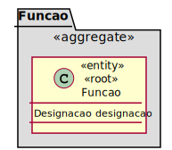

# UC - Criar Função de Colaborador

# 1. Requisitos
## Formato Breve

- Como RRH (Responsável de Recursos Humanos) pretendo criar uma função de helpdesk.estruturaorganica.domain.colaborador;
- Esta função carateriza-se por ter uma designação;
- A designação deve conter letras.

## Regras de Negócio

- A função deve ser única no sistema.

# 2. Análise

Excerto do Modelo de Domínio relevante para o Caso de Uso  

# 3. Design

* A função deve ser persistida, sendo considerada uma entidade (root do seu agregado). Por sua vez, contendo uma designação, foi considerado que esta seria promovida a value object, dado conter regras inerentes ao modelo de negócio. Nesta classe designação são, assim, feitas as validações necessárias.  

## 3.1. Padrões Aplicados

* Repository -> Persistência das classes
* Single Responsibility Principle e Information Expert -> Classes de domínio
* Creator -> criação de instâncias de Funcao
* Data Transfer Object -> Para apresentação dos objectos de dominio, de forma isolada do dominio em si, baixando o acoplamento.

## Plano de Testes

### 0. Comum a todos os testes:

- Autenticação por parte do RRH;
- Selecionar a opção X de especificar nova função

### 1 Especificar nova função (corretamente)

- Introduzir os campos que caraterizam uma função;
- Selecionar a opção Y de listagem de todas as funções e verificar que uma nova função foi efetivamente criada.

### 2 Tentar especificar uma função já existente

- Criar uma função com os mesmos dados da função previamente criada;
- O sistema deverá alertar que uma função com esta mesma designação já existe;
- Selecionar a opção Y de listar todas as funções e verificar que não existe qualquer função repetida.

## Testes Unitários

**Teste 1:** Verificar que não é possível criar uma instância da classe Funcao com valores nulos.

	@Test(expected = IllegalArgumentException.class)
		public void ensureNullIsNotAllowed() {
		Exemplo instance = new Exemplo(null);
	}

**Teste 2:** Verificar que não é possível criar uma instância da classe Funcao com valores númericos.

	@Test(expected = IllegalArgumentException.class)
		public void ensureNullIsNotAllowed() {
		Exemplo instance = new Exemplo("Trolha1");
	}