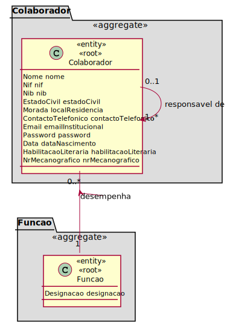

# UC - Registar Colaborador

## Formato Breve

- Como RRH (Responsável de Recursos Humanos) pretendo adicionar um helpdesk.estruturaorganica.domain.colaborador;
- O helpdesk.estruturaorganica.domain.colaborador é caraterizado por um nome curto, pelo nome completo, nif, nib, estado civil, local de residência, contacto telefónico, email institucional, password, data de nascimento, habilitações literárias, número mecanográfico (número de helpdesk.estruturaorganica.domain.colaborador) e pela função que desempenha, além do seu responsável hierárquico (se houver);
- Um helpdesk.estruturaorganica.domain.colaborador pode também estar associado a diversas equipas, desde que de tipos diferentes;
- Um helpdesk.estruturaorganica.domain.colaborador desempenha, ainda, uma função.

## Regras de Negócio

- O NIF, o NIB e o contacto telefónico, além de únicos no sistema, devem ser compostos por 9, 16 e 9 algarismos (respetivamente);
- O estado civil pode ser ou solteiro, ou casado;
- A data de nascimento deve ser composta por algarismos, respeitando a quantidade de dias por mês e a de meses por ano;
- O local de residência deve ser composto por uma morada, código-postal (do tipo XXXX-XXX, 7 algarismos) e localidade;
- O nome deve ser composto só por letras;
- O email institucional deve terminar da forma "@(...)" ".pt" ou ".com";

# 2. Análise

Excerto do Modelo de Domínio relevante para o Caso de Uso  

## 3.1. Padrões Aplicados

* Repository -> Persistência das classes
* Single Responsibility Principle e Information Expert -> Classes de domínio
* Creator -> criação de instâncias de Colaborador e ademais Value Objects
* HC + LC -> delegação da criação das classes Value Objects à classe Colaborador
* Data Transfer Object -> Para apresentação dos objectos de dominio, de forma isolada do dominio em si, baixando o acoplamento.
* Strategy -> importação de dados em ficheiro csv

## Plano de Testes

### 0. Comum a todos os testes:

- Autenticação por parte do RRH;
- Selecionar a opção X de registar novo helpdesk.estruturaorganica.domain.colaborador

### 1.1 Criar um novo helpdesk.estruturaorganica.domain.colaborador de forma normal (associando a equipa)

- Introduzir os campos que caraterizam o helpdesk.estruturaorganica.domain.colaborador
- Listagem de funções disponíveis e seleção de uma
- Listagem de equipas e seleção de uma

### 1.2 Criar um novo helpdesk.estruturaorganica.domain.colaborador de forma normal (sem equipa associada)

## Testes Unitários
