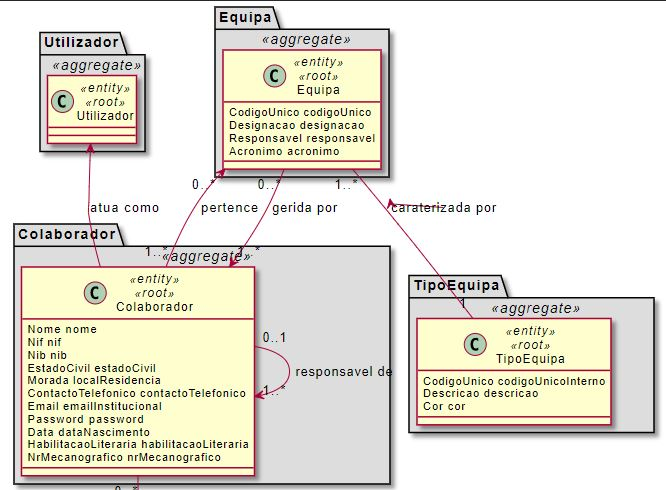
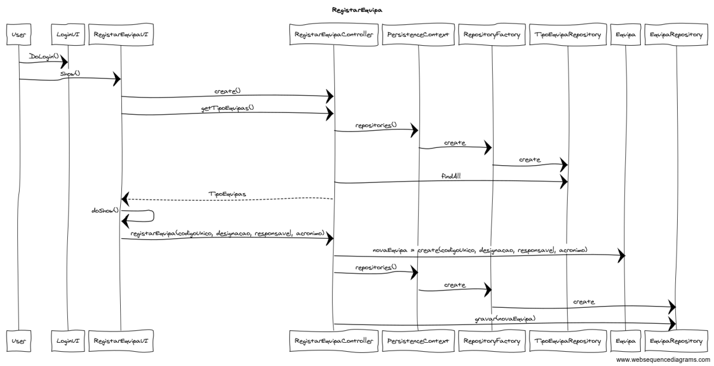

# US 2052 - Registar Equipa

=======================================

Como Responsável dos Recursos Humanos (RRH) pretendo criar uma nova equipa. 
Uma equipa caracteriza-se por:

* Ser de um determinado tipo;
* Um código único;
* Um acrónimo;
* Uma designação;
* Possui um ou mais colaboradores responsáveis.

# 2. Análise

Excerto do Modelo de Domínio relevante para o Caso de Uso  

## 2.1. A ter em consideração

* O código único é alfa-numérico com um máximo de 15 caracteres (https://moodle.isep.ipp.pt/mod/forum/discuss.php?d=7561)
* O acrónimo da equipa tem de ser único e alfanumérico (https://moodle.isep.ipp.pt/mod/forum/discuss.php?d=7885)
* O acrónimo tem de ter no máximo 10 caracteres (https://moodle.isep.ipp.pt/mod/forum/discuss.php?d=7642)
* A designação pode ter até 50 caracteres (https://moodle.isep.ipp.pt/mod/forum/discuss.php?d=7561)
* Não existe limite máximo de colaboradores responsáveis por equipas (https://moodle.isep.ipp.pt/mod/forum/discuss.php?d=7916)

## 2.2. Fluxo de realização

Actor: Responsável dos Recursos Humanos (RRH)

* Login  
* Sistema apresenta lista de tipo de equipas disponiveis.
* Sistema apresenta lista de colaboradores.
* O utilizador especifica os atributos da equipa  
	* Um código único;  
	* Um acrónimo;  
	* Uma designação;  
* O utilizador selecciona o tipo de equipa no qual a nova equipa se vai inserir. 
* O utilizador seleciona o(s) helpdesk.estruturaorganica.domain.colaborador(s) responsável pela equipa. 
* O utilizador adiciona a nova equipa.

# 3. Design

A Equipa deve ser persistida, tendo sido assim considerada como entidade e como root do seu próprio agregado.  
Os atributos desta entidade têm regras especificas inerentes ao negócio, por este motivo, são promovidos a Value Objects do sistema. Assim em cada objecto serão especificas todas as regras e validações necesárias. 

Sequence Diagram - Criar Equipa
  

## 3.1. Padrões Aplicados

* Repository -> Persistência das classes
* Single Responsibility Principle e Information Expert -> Classes de domínio
* Creator -> criação de instâncias de Equipa e ademais Value Objects
* HC + LC -> delegação da criação das classes Value Objects à classe Equipa
* Data Transfer Object -> Para apresentação dos objectos de dominio, de forma isolada do dominio em si, baixando o acoplamento.

## 3.2. Testes

**Teste 1:** Verificar que não é possível criar uma instância da classe Equipa com o código unico com valor nulo.

    @Test(expected = IllegalArgumentException.class)
    	public void ensureNullIsNotAllowed() {
    	Exemplo instance = new Exemplo(null, null);
    }

**Teste 2:** Verificar que não é possível criar uma instância da classe Equipa com a designação vazia.

    @Test(expected = IllegalArgumentException.class)
    	public void ensureNullIsNotAllowed() {
    	Exemplo instance = new Exemplo(null, null);
    }

**Teste 3:** Verificar que uma Equipa deve de pertencer a um Tipo de Equipa.

    @Test(expected = IllegalArgumentException.class)
    	public void ensureNullIsNotAllowed() {
    	Exemplo instance = new Exemplo(null, null);
    }

**Teste 4:** Verificar que não é possível criar uma instância da classe Equipa com a designação com mais de 50 caracteres.

    @Test(expected = IllegalArgumentException.class)
    	public void ensureNullIsNotAllowed() {
    	Exemplo instance = new Exemplo(null, null);
    }
	
	
**Teste 5:** Verificar que não é possível criar uma instância da classe Equipa com um acrónimo não alfanumérico e com máximo de 10 caracteres.

    @Test(expected = IllegalArgumentException.class)
    	public void ensureNullIsNotAllowed() {
    	Exemplo instance = new Exemplo(null, null);
    }

# 4. Observações

.
