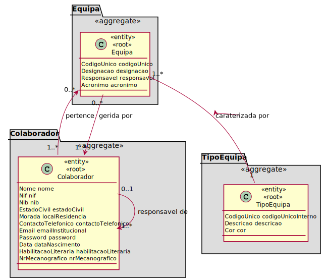

# UC - Associar/Remover Colaborador de Equipa

# 1. Requisitos
## Formato Breve

- Como RRH (Responsável de Recursos Humanos) pretendo associar, ou remover, um helpdesk.estruturaorganica.domain.colaborador a uma equipa;
- Esta função carateriza-se por ter uma designação;
- A designação deve conter letras.

## Regras de Negócio

- Um helpdesk.estruturaorganica.domain.colaborador pode pertencer a várias equipas;
- Um helpdesk.estruturaorganica.domain.colaborador só pode pertencer a um tipo de equipa.

# 2. Análise

Excerto do Modelo de Domínio relevante para o Caso de Uso  

# 3. Design

* A lista de equipas a que um helpdesk.estruturaorganica.domain.colaborador pertence deve ser persistida;
* O RRH (ator do sistema), após fazer login, deve verificar a lista de colaboradores a escolher. Depois de escolhido 1, ser-lhe-á apresentada uma lista de equipas elegíveis para o helpdesk.estruturaorganica.domain.colaborador escolhido, isto é, uma lista de equipas filtrada pelo seu tipo, dado que um helpdesk.estruturaorganica.domain.colaborador não pode pertencer a duas equipas do mesmo tipo;
* O RRH escolhe a equipa, sendo esta adicionada à lista de equipas do helpdesk.estruturaorganica.domain.colaborador.  

## 3.1. Padrões Aplicados

* Repository -> Persistência das classes
* Single Responsibility Principle e Information Expert -> Classes de domínio
* Data Transfer Object -> Para apresentação dos objectos de dominio, de forma isolada do dominio em si, baixando o acoplamento.

## Plano de Testes

### 0. Comum a todos os testes:

- Autenticação por parte do RRH;
- Selecionar um helpdesk.estruturaorganica.domain.colaborador de uma lista;

### 1 Escolher o helpdesk.estruturaorganica.domain.colaborador (corretamente)

- Escolher o helpdesk.estruturaorganica.domain.colaborador, caso exista algum;

### 2 Selecionar uma opção (helpdesk.estruturaorganica.domain.colaborador) inexistente

- Sistema pede para escolher novamente.

### 3 Sem colaboradores para escolher

- Sistema informa que não há colaboradores.

### 4 Tentar escolher uma equipa (corretamente)

- Escolher a equipa, caso exista alguma.

### 5 Selecionar uma opção (equipa) inexistente

- Sistema informa que a opção escolhida não existe e pede ao RRH para escolher novamente.

### 6 Sem equipas para escolher

- Sistema informa que o helpdesk.estruturaorganica.domain.colaborador não pode ser alocado a mais equipas.

## Testes Unitários

