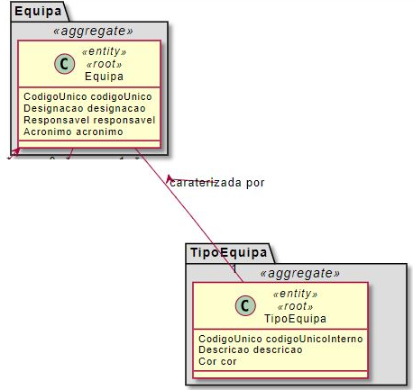
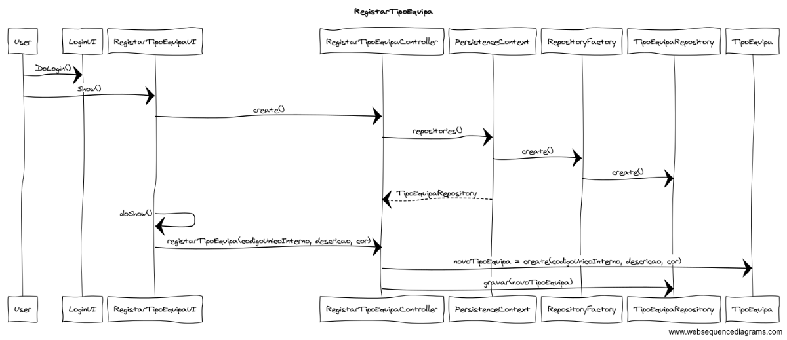

# US 2054 - Registar Tipo Equipa

=======================================

Como Responsável dos Recursos Humanos (RRH) pretendo criar um novo tipo de equipa. 
Um tipo de equipa caracteriza-se por:

* Um código único interno;
* Uma descrição;
* Uma cor;

# 2. Análise

Excerto do Modelo de Domínio relevante para o Caso de Uso  

## 2.1. A ter em consideração

* O código único é alfa-numérico com um máximo de 15 caracteres (https://moodle.isep.ipp.pt/mod/forum/discuss.php?d=7561)
* A descrição pode ter até 50 caracteres (https://moodle.isep.ipp.pt/mod/forum/discuss.php?d=7561)

## 2.2. Fluxo de realização

Actor: Responsável dos Recursos Humanos (RRH)

* Login  
* O utilizador especifica os atributos do tipo de equipa  
	* Um código único;  
	* Uma descrição;  
	* Uma cor;  
* O utilizador adiciona um novo tipo de equipa.

# 3. Design

O Tipo de Equipa deve ser persistida, tendo sido assim considerada como entidade e como root do seu próprio agregado.  
 

Sequence Diagram - Registar Tipo Equipa
  

## 3.1. Padrões Aplicados

* Repository -> Persistência das classes
* Single Responsibility Principle e Information Expert -> Classes de domínio
* Creator -> criação de instâncias de Tipo de Equipa e ademais Value Objects
* HC + LC -> delegação da criação das classes Value Objects à classe Tipo de Equipa
* Data Transfer Object -> Para apresentação dos objectos de dominio, de forma isolada do dominio em si, baixando o acoplamento.

## 3.2. Testes

**Teste 1:** Verificar que não é possível criar uma instância da classe Tipo de Equipa com o código unico interno com valor nulo.

    @Test(expected = IllegalArgumentException.class)
    	public void ensureNullIsNotAllowed() {
    	Exemplo instance = new Exemplo(null, null);
    }

**Teste 2:** Verificar que não é possível criar uma instância da classe Equipa com a descrição vazia.

    @Test(expected = IllegalArgumentException.class)
    	public void ensureNullIsNotAllowed() {
    	Exemplo instance = new Exemplo(null, null);
    }

**Teste 3:** Verificar que não é possível criar uma instância da classe Tipo de Equipa com a descrição com mais de 50 caracteres.

    @Test(expected = IllegalArgumentException.class)
    	public void ensureNullIsNotAllowed() {
    	Exemplo instance = new Exemplo(null, null);
    }

**Teste 4:** Verificar que não é possível criar uma instância da classe Tipo de Equipa com um código único não alfanumérico e com máximo de 15 caracteres.

    @Test(expected = IllegalArgumentException.class)
    	public void ensureNullIsNotAllowed() {
    	Exemplo instance = new Exemplo(null, null);
    }

# 4. Observações

.
