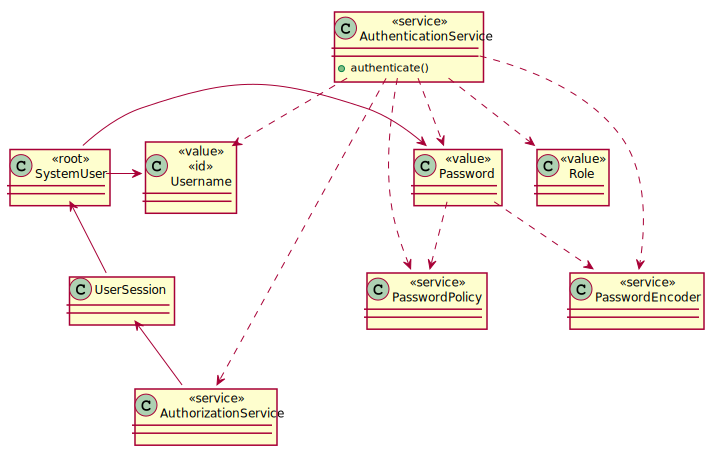
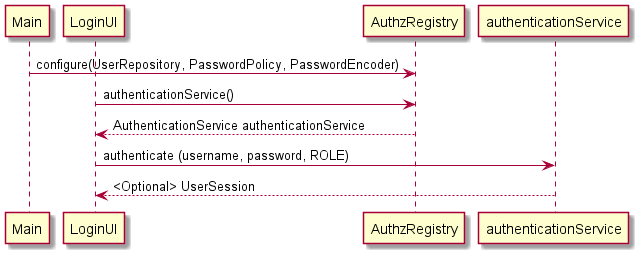
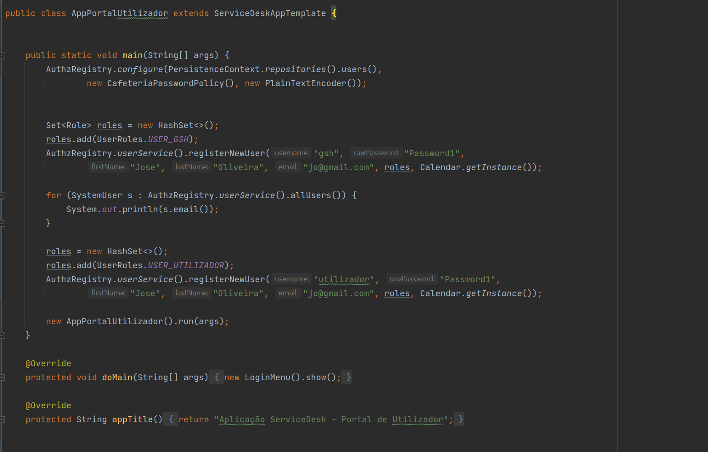
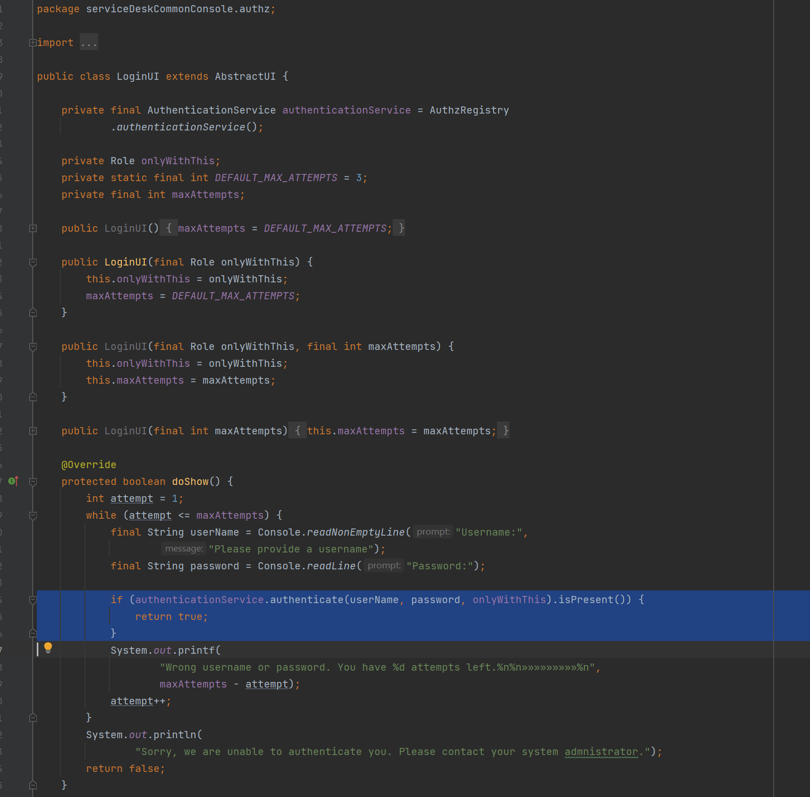

# US8001 - Efetuar Login no Sistema
=======================================

# 1. Requisitos

Pretende-se ser capaz de efetuar login com um utilizador registado no sistema e espera-se ter acesso unicamente às funcionalidades a que esse utilizador tenha permissão para aceder.

# 2. Análise

O processo de login e verificação de autorização através da framework de EAPLI baseia-se fundamentalmente na utilização das classes **1.AuthzRegistry**, **2.AuthenticationService** e **3.AuthorizationService**.

 

### 1. Public final class **AuthzRegistry** (@Singleton)

Consiste no registo dos objetos serviço do componente. É necessário chamar o seu método *configure()* ao iniciar a aplicação para injetar a implementação de UserRepository, PasswordPolicy e PasswordEncoder a utilizar.

Exemplo de utilização:

    public static void Main(final String[] args) {
       AuthzRegistry.configure(PersistenceContext.repositories().users(),
               new CafeteriaPasswordPolicy(), new PlainTextEncoder());

       new ECafeteriaBackoffice().run(args); }

Podemos obter uma instancia de AuthenticationService através do método estático authenticationService().
Do mesmo modo, podemos obter uma instancia de AuthorizationService através do método estático authorizationService().

 

 ### 2.  Public class **AuthenticationService**

Pode ser obtido através do método estático authenticationService() da classe AuthzRegistry.

Possui o método *authenticate* que nos permite fazer o Login com um utilizador registado no sistema.

	Optional<UserSession>	authenticate(String username, String rawPassword, Role... requiredRoles)

Exemplo de utilização:

	...			

	private final AuthenticationService authenticationService = AuthzRegistry.authenticationService();
	...

	if (authenticationService.authenticate(userName, password, CafeteriaRoles.CAFETERIA_USER).isPresent()){
		return true;
	}
	...

    

### 3. Public class **AuthorizationService**

Pode ser obtido através do método estático authorizationService() da classe AuthzRegistry.

Possui o método *ensureAuthenticatedUserHasAnyOf* que nos permite confirmar se o utilizador que possui sessão iniciada, tem a permissão(role/papel) especificada por parâmetro. E lança uma exceção em caso contrário.

Exemplo de utilização:

	private final AuthorizationService authz = AuthzRegistry.authorizationService();

	authz.ensureAuthenticatedUserHasAnyOf(CafeteriaRoles.POWER_USER,
               CafeteriaRoles.MENU_MANAGER);

<!--  -->

 

 Para mais detalhas consultar javadoc do componente *"authz"* da framework [aqui](https://pagsousa.bitbucket.io/13.0/eapli.framework.authz/).

 

# 3. Design

No design foi seguida a utilização da framework EAPLI, de acordo com a documentação e seguindo o exemplo do projeto eCafeteria.

## 3.1. Realização da Funcionalidade

## 3.4. Testes 
Não foram realizados testes pois a código utilizado,e consequente testagem, pertence à framework.

# 4. Implementação
De seguida podemos ver a implementação usada no componentes "Portal de Utilizadores" em que se configura o singleton AuthzRegistry para posteriro autorização.
Pode ver-se também um bootstrap **temporário** rudimentar para permitir o login na aplicação. 

Pode também ver-se a validação da autenticação efetuada na classe LoginUI.

# 5. Integração/Demonstração

*Nesta secção a equipa deve descrever os esforços realizados no sentido de integrar a funcionalidade desenvolvida com as restantes funcionalidades do sistema.*

# 6. Observações

*Nesta secção sugere-se que a equipa apresente uma perspetiva critica sobre o trabalho desenvolvido apontando, por exemplo, outras alternativas e ou trabalhos futuros relacionados.*

