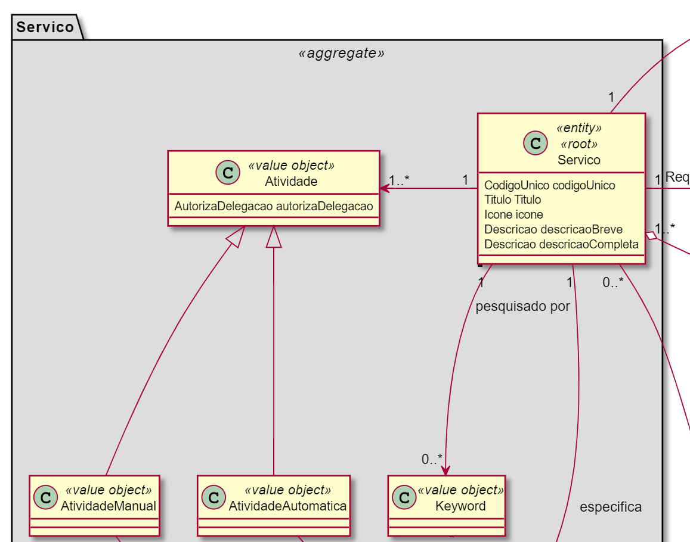
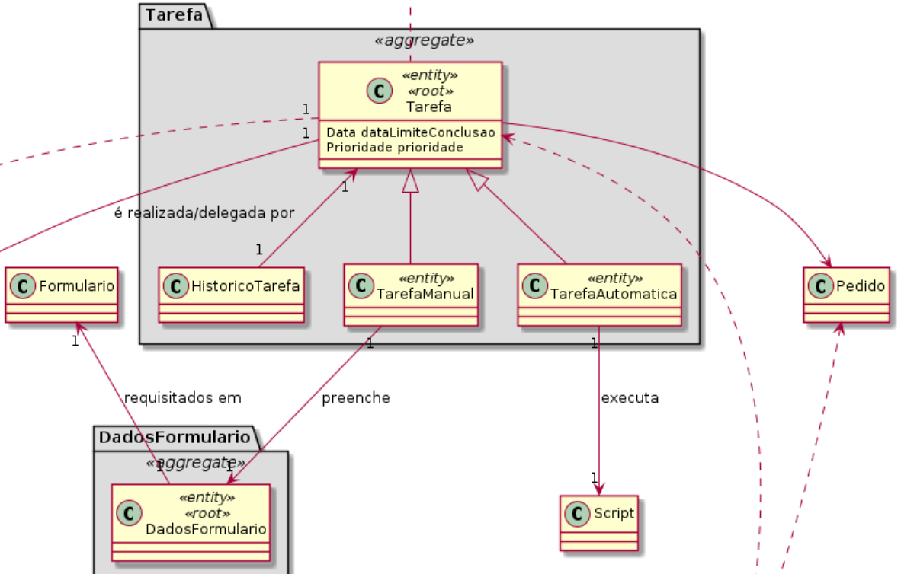

# US1005 - Componente Tarefa Manual
=======================================

# 1. Requisitos

**User Story 1005:** Como Gestor de Projeto, eu pretendo que seja desenvolvida a componente representativa de uma tarefa manual dedicada à apresentação e recolha de informação a/de um utilizador no âmbito de um pedido e que a mesma seja adicionada à biblioteca de atividades típicas do sistema para, dessa forma, poder ser usada na definição de fluxos de atividades.

**Critérios de aceitação:** n/a

**Caso de uso 4.3.3.a:** De momento, pretende-se adicionar ao sistema:
Componente representativo de uma tarefa manual a ser realizada por um determinado
colaborador ou por um colaborador pertencente a uma determinada equipa. A realização
da tarefa pode requerer o preenchimento de um formulário. Estas informações são
especificadas aquando da inclusão do componente num fluxo;

- - -
**NOTA:** No caderno de encargos são utilizados os termos "Tarefa" e "Atividade" como sinónimos, existindo separadamento o conceito de "componente representativo de uma tarefa".
No entanto, desde o Sprint B, foi adotado no nosso projeto o uso de "Atividade" para nos referirmos ao "componente representativo de uma tarefa", sendo o termo "Tarefa" a única designação válida para nos referirmos a uma tarefa. Como tal, esta será a nomenclatura utilizada na documentação.
 - -  -
Foi interpretado que seria necessário criar a Atividade manual durante a especificação do Serviço, para que possam ser introduzidas pelo GSH as caracteristicas/requisitos que definem o comportamento da Tarefa Manual correspondente, seja esta a Tarefa de Aprovação ou a Tarefa de Realização Manual (que será criada mais tarde aquando da solicitação do Serviço).

Por exemplo, a Atividade Manual irá conter a definição do formulário (e as suas regras e validações) que será apresentado aquando da realizaçao da Tarefa Manual correspondente.
 
  

# 2. Análise

Eslarecimento adicional por parte do cliente:

[moodle, 17/05/2021](https://moodle.isep.ipp.pt/mod/forum/discuss.php?d=8387)

	1. Estas US(1005 e 1006) não devem ser vistas como casos de uso onde há um ator e uma UI para realizar a mesma. Pelo contrário, notem que quem aparece associado às US é o "Gestor de Projeto" que não é ator em nenhuma das aplicações em desenvolvimento.

	2. Assim, estas duas US correspondem a itens de trabalho de caracter mais técnico que visam permitir ao sistema como um todo (e não apenas à aplicação X ou Y) reconhecer e lidar com diferentes tipos de atividades. De momento, o sistema apenas precisa de reconhecer dois tipos de atividades (i) manual e (ii) automática baseada em script. Contudo, o sistema deve estar preparado para facilmente suportar outros tipos de atividades (e.g. executar uma bash file). 

	3. O conjunto de tipos de atividades reconhecidos pelo sistema é denominado de "biblioteca de atividades típicas". Portanto, cada uma destas US visa tecnicamente acrescentar um tipo de atividades a esta biblioteca.

	4. As atividades a incluir no fluxo de atividades de um serviço (no máximo duas) têm que ser de um tipo de de atividade existente nesta biblioteca. Neste caso ou serão do tipo "manual" ou do tipo "automática baseada em script". Contudo, notem que futuramente podem ser de outro tipo. O tipo de atividade determina a informação a solicitar para que a atividade fica especificada.

 

* A especificação da Atividade Manual está enquadrada na especificação do serviço. Seja no contexto da Tarefa de aprovação seja no contexto de Tarefa de realização manual. 

* Quando for definido que é necessária uma Tarefa de Aprovação então terá de ser especificada a Atividade Manual correspondente.

* Quando for definido que a realização do serviço é feita através de uma Tarefa Manual, então terá de ser especificada a Atividade Manual correspondente.

* O responsável pela realização da Tarefa de aprovação, seja o responsável hierárquico do utilizador ou o colaborador responsável pelo catálogo, será também definido imediatamente antes ou depois da especificação da Atividade manual, embora este ponto se encontre já enquadrado na "US2003 - Completar especificação do Serviço".

# 3. Design

* Como serão suportadas vários tipos de atividades?

	Como se pode ver no excerto seguinte, o modelo de domínio definido suporta esta possibilidade através de um mecanismo de herança, garantindo que outros tipos de atividade podem ser adicionados extendendo a Classe Atividade. Da mesma forma, a classe Tarefa permite o mesmo funcionamento.

	

	

 

* Como será implementada a atribuição da responsabilidade de realização, já que pode ser atribuida a um colaborador ou equipa?

* Quais sãos os campos/atributos minimos para considerar um formulario de uma atividade válido?

 
 
 
 
 
 

	

## 3.1. Realização da Funcionalidade

### Fluxo:
1. Durante a especificação do serviço, é solicitado ao GSH se existe uma atividade de aprovação.
2. Se existir, será necessário preencher todos os dados necessários para a especificação do formulário dessa atividade.
3. O sistema solicitará também ao GSH se o reponsável pela autorização é o responsável hierárquico do utilizador ou o colaborador responsável pelo catálogo.
4. O GSH introduz a opção pretendida.
5. De seguida, o sistema solicita ao GSH se a Atividade poderá ser delegada a outro colaborador.
6. O GSH introduz a opção pretendida.
7. (podem ser solicitados outros dados para a especificação do Serviço)
8. O sistema solicita ao GSH se a atividade de realização é manual.
9. Se a atividade de realização for manual será necessário novamente introduzir os dados para a especificação do formulário associado (número e tipo de atributos, scripts de validação, etc.)
10. A(s) Atividade(s) serão guardadas juntamente com o Serviço(pertencem ao mesmo agregado) ao ser terminado a especificação do mesmo.

 

## 3.2. Padrões e principios aplicados

	Principio Open/Close -> Permitindo a adição de atividades diferentes sem ter de alterar o código já existente.
	Principio GRASP Information Expert -> Para atribuição da responsabilidade de criar objetos atividade ao Serviço já que é esta a classe que agrega/contém os objetos Atividade.

## 3.4. Testes 

**Teste 1:** Verificar que não é possivel criar uma Atividade Manual com parametro(s) a null.

	@Test(expected = IllegalArgumentException.class)
		public void verificarNuloNaoPermitido() {
		AtividadeManual atividade = new AtividadeManual(null);
	}

**Teste 2:** Verificar que não é possivel criar uma Atividade Manual sem especificar corretamente o seu formulário(ver critérios de validade do formulário).

	@Test(expected = IllegalArgumentException.class)
		public void verificarFormularioInvalido() {
		AtividadeManual atividade = new AtividadeManual(new Formulario(), autorizaDelegacao);
	}

**Teste 3:** Verificar que não é possivel criar uma Atividade Manual para aprovação sem definir quem é o responsável por essa aprovação.

	@Test

**Teste 4:** Verificar que não é possivel criar uma Atividade Manual para realização sem definir quem é o colaborador ou equipa a qual será assignada a Tarefa correspondente.
	@Test
	

<!-- # 4. Implementação

*Nesta secção a equipa deve providenciar, se necessário, algumas evidências de que a implementação está em conformidade com o design efetuado. Para além disso, deve mencionar/descrever a existência de outros ficheiros (e.g. de configuração) relevantes e destacar commits relevantes;*

*Recomenda-se que organize este conteúdo por subsecções.*

# 5. Integração/Demonstração

*Nesta secção a equipa deve descrever os esforços realizados no sentido de integrar a funcionalidade desenvolvida com as restantes funcionalidades do sistema.*

# 6. Observações

*Nesta secção sugere-se que a equipa apresente uma perspetiva critica sobre o trabalho desenvolvido apontando, por exemplo, outras alternativas e ou trabalhos futuros relacionados.*
 -->

