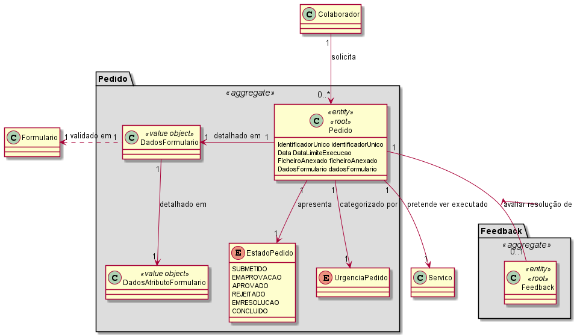

# 3002 - Como utilizador, eu pretendo solicitar um serviço do catálogo de serviços que me é disponibilizado.
=======================================

# 1. Requisitos

Como utilizador, eu pretendo solicitar um serviço do catálogo de serviços que me é disponibilizado. 
A solicitação de um serviço resulta num pedido que de base é caracterizado por:
* Um identificador automático único e sequencial por ano (e.g. “2021/00037”)
* Um colaborador (quem solicitou o serviço)
* O serviço pretendido e respetiva criticidade (cf. SLA do serviço)
* Urgência do pedido (reduzida, moderada, urgente)
* Data limite de resolução pretendida 
* Por um conjunto de ficheiros anexados ao mesmo (0 ou mais ficheiros)

Para além desta informação, do mesmo deve constar:
* Os dados/valores relativos aos atributos do formulário de solicitação de serviço;
* Os dados/valores relativos aos atributos de outros formulários recolhidos na sequência
da realização das atividades previstas no fluxo de aprovação e de resolução associado ao
serviço pretendido;
* Dados de suporte à aferição do cumprimento dos objetivos de SLA;
* O estado do pedido
  * (i) submetido
  * (ii) em aprovação
  * (iii) aprovado 
  * (iv) rejeitado
  * (v) em resolução
  * (vi) concluído/resolvido.
   
Por cada novo pedido é desencadeado a realização das atividades (de aprovação e de satisfação do
pedido) previstas no respetivo serviço. Este desencadeamento de ações vai ser controlado pelo motor de fluxos.

        Nota:
        De acordo com o caderno de encargos seria requisito porder solicitar um serviço para outro colaborador, porém de acordo com as informações do cliente não é necessário (https://moodle.isep.ipp.pt/mod/forum/discuss.php?d=8362)

# 2. Análise

Excerto do Modelo de Domínio relevante para o Caso de Uso  

* Entidade Pedido -> Root do agregado "Pedido"
* Dados formulário -> Value object que pede ao serviço (contido no pedido) o seu formulário
* Após saber qual a instância deste, envia para o mesmo os seus próprios dados de forma a ser validado
* Entidade Feedback -> Root do agregado "Feedback". Por ser realizado após a conclusão do pedido, e para evitar carregar para a memória todos os dados inerentes ao pedido, criou-se um agregado especifico para o utilizador poder dar feedback sobre os pedidos. Feedback tem uma associação com o pedido.

## 2.2. Fluxo de realização

Actor: Colaborador / Utilizador do sistema

* Login  
* O sistema apresenta uma lista de serviços de acordo com o US3001
* O utilizador escolhe o serviço a solicitar
* O utilizador insere os campos requeridos
  * Urgência do pedido (reduzida, moderada, urgente)
  * Data limite de resolução pretendida 
  * Ficheiros a anexar
* O sistema solicita o preenchimento do formulário
* O utilizador preenche o formulário e submete o pedido
* O sistema notifica o motor de fluxos que registou o pedido com o código 050 

# 3. Design

O pedido deve ser persistido, tendo sido assim considerado como entidade e como root do seu próprio agregado.  
Os atributos desta entidade têm regras especificas inerentes ao negócio. Assim em cada objecto serão especificas todas as regras e validações necesárias. 

## 3.1. Testes 

public Pedido(String identificadorDoUltimoPedido, Servico servico, Colaborador solicitante) {

**Teste 1:** Verificar que não é possível criar uma instância da classe Pedido com o serviço a nulo e respetivo colaborador que o solicita.

**Teste 2:** Verificar que o identificador único funciona para as diferentes situações, quando recebe um valor nulo referente ao último código gerado, quando não transita de ano e quando transita.

**Teste 3:** Verificar que não é possível submeter um pedido se um dos seguintes atributos não for nulo
    * identificador
    * solicitante
    * servico
    * dataResolucaoPretendida
    * urgenciaPedido
    * formularioSolicitacao (além de não ser nulo, este tem que estar corretamente validado)

# 4. Observações

.
