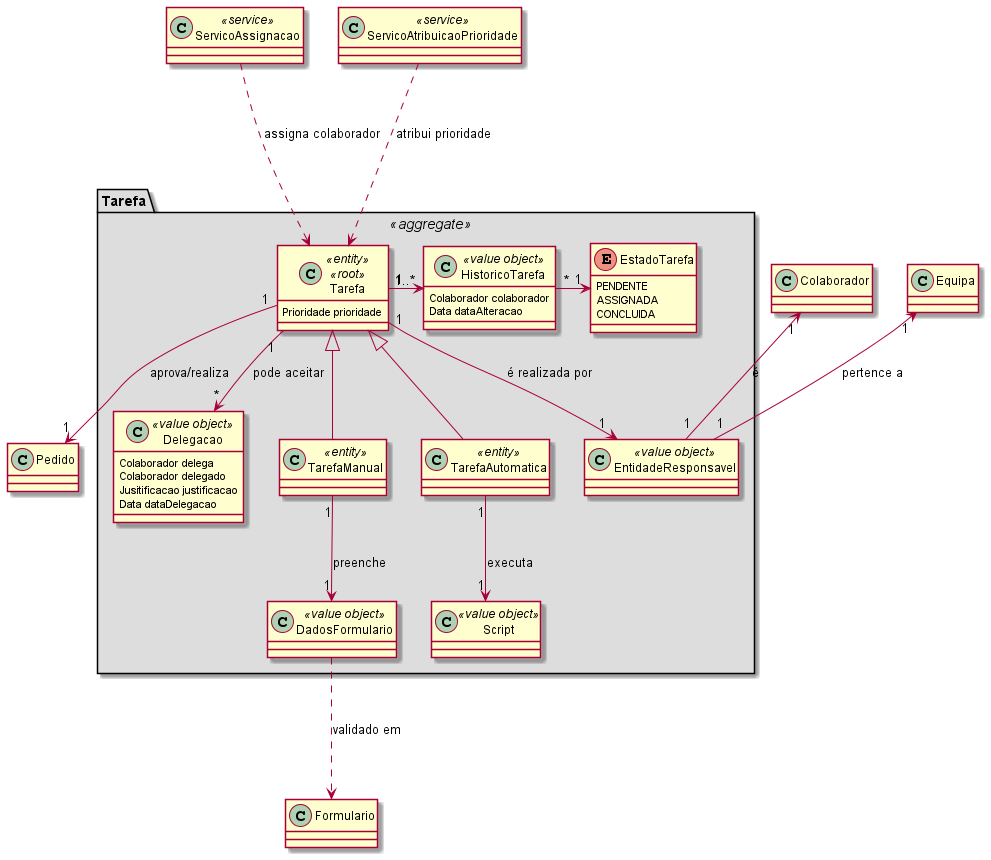
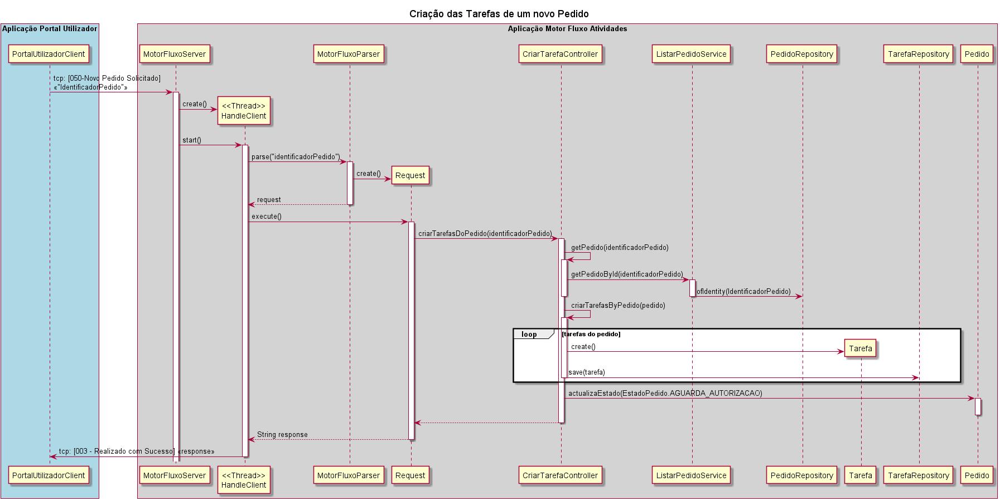
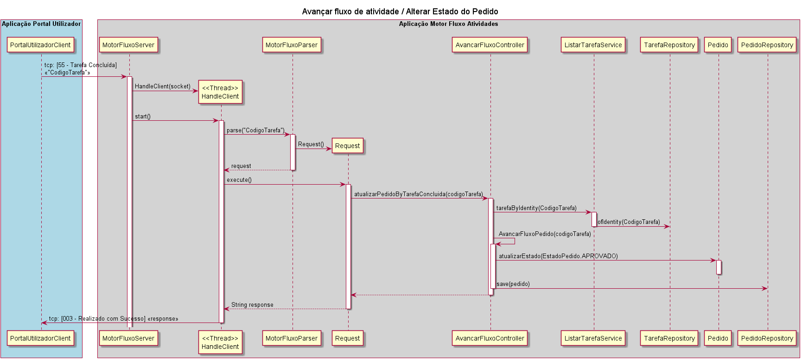

# US4001 - Motor de Fluxo de Atividades
=======================================

# 1. Requisitos

**User Story:**
Como Gestor de Projeto, eu pretendo que seja desenvolvido no Motor de Fluxo de Atividade o mecanismo de gestão/controlo/avanço do fluxo de atividades de um dado pedido.

**Critérios de aceitação:**
No caso do Motor de Fluxo de Atividade encontrar uma atividade automática, este deve solicitar e monitorizar a sua execução no Executor de Tarefas Automáticas. Para tal, deve ser usado o protocolo de aplicação fornecido (SDP2021). 

---

**Interpretação:**

Esta user story pode ser decomposta em 4 funcionalidades distintas a implementar:

- Criação das Tarefas de um novo Pedido
- Atualização do estado do pedido/ Avanço do fluxo de Atividade
- Delegação da realização das Tarefas Automáticas ao Executor de Tarefas Automáticas e alteração do estado da Tarefa Automática (partilhado com a US5001)
- Fornecer informação sobre estado de pedidos e informação das tarefas (prioridade, estado, tempos)

# 2. Análise

Caderno de Encargos, pag.13

	A área de gestão e execução de fluxo contempla:

	1. Avançar fluxo de atividade de um pedido. Quando um pedido é criado e/ou uma tarefa do fluxo 	de atividades subjacente a esse pedido é concluída, torna-se necessário verificar o estado do pedido e fazê-lo progredir criando as condições necessárias à execução da próxima tarefa ou, caso não haja mais nenhuma tarefa a executar, dando esse pedido como concluído.

	2. Executar atividade automática. No âmbito de cada pedido há ou pode haver a necessidade do sistema executar, por si, atividades/tarefas automáticas em conformidade com o especificado nos respetivos fluxos de atividades. Esta execução deve ser espoletada e gerida a partir de uma aplicação/servidor central, mas a sua efetiva execução decorrer noutro servidor distinto.

	3. Adicionar componente de especificação de fluxos ao sistema. A especificação de fluxos de atividades assenta no uso (e combinação) de componentes representativos de tipos de atividades que são reconhecidos pelo sistema. Torna-se, assim, necessário que o sistema suporte a adição destes componentes de forma simplificada. De momento, pretende-se adicionar ao sistema:

		a. Componente representativo de uma tarefa manual a ser realizada por um determinado colaborador ou por um colaborador pertencente a uma determinada equipa. A realização da tarefa pode requerer o preenchimento de um formulário. Estas informações são especificadas aquando da inclusão do componente num fluxo;

		b. Componente representativo de uma tarefa automática a ser realizada pelo sistema e que consiste na execução de um script especificado aquando da inclusão do componente num fluxo. Salienta-se que para a execução correta de algumas partes do script (e.g., envio de email) pode requerer a configuração única e centralizada de dados (e.g., o servidor/conta de email por onde os emails são remetidos).

	4. Monitorizar e Disponibilizar informação diversa sobre os fluxos de atividades em curso. Alguns exemplos são:
		a. Resumo de informação sobre os processos pendentes;
		b. Informação para construção de dashboard do utilizador;

 

* **Quais são os atributos necessários na Tarefa?**

	- Identidade global (CodigoTarefa)
	- Identificação do Pedido a que se refere
	- Valor de Prioridade da Tarefa 
	- Histórico das alterações do estado da Tarefa com a data e hora respetiva (registo da transição de estado, colaborador que responsavel na altura da alteração do estado, registo de data e hora para avaliação de acordo com SLA)
	- Diferentes estados (pendente, assignada, concluida)
	- Registo de Informação no caso de delegação(delegações) (Colaboradores envolvidos, justificação, data e hora)

	No caso da TarefaManual necessitamos:
	- Classe responsável por guardar os dados que vão ser introduzidos pelo Colaborador durante a realização da Tarefa -> DadosFormulario

	No caso da TarefaAutomatica (baseada em Script) temos:
	-  Classe responsável por guardar o script a usar na realização automática -> Script

 

* **Qual a identidade global da Tarefa?**

	Uma vez que Tarefa é a raiz do seu próprio agregado necessita de um entidade global no sistema.
	Como o cliente não referiu nenhum identificador especifico, atribuimos um "CodigoTarefa" baseado numa sequencia númerica linear começada em 0. (0, 1, 2, 3...)

 

* **Porquê criar a Tarefa no Motor de Fluxo de Atividade?**

	Uma vez que o motor de fluxos é responsavel pela gestão das tarefas, as suas transições de estado e, no caso de serem automáticas, responsável da delegação da sua realização, faz sentido que seja também reponsável pela sua criação.

	Assim, ao terminar a solicitação de um serviço, será enviada uma mensagem desde a aplicação Portal Utilizador, através do protocolo de comunicação definido (código 50 -Novo Pedido Solicitado, contendo o identificador do Pedido criado),  para a aplicação Motor de Fluxo de Atividades. Esta, por sua vez, ficará encarregue de criar as Tarefas associadas a esse pedido.

* **Deveria HistoricoTarefa ter o seu próprio agregado?**

	- HistoricoTarefa poderia existir num agregado separado por dois motivos principais:
	 1. por uma questão de performance/memória -> o agregado Tarefa tem uma referência para pedido que contém uma referência para Serviço. Ambos são agregados de grandes dimensões.
	 2. por uma questão de acessos concurrentes -> é possivel existirem vários acessos concurrentes para realizar tarefa, delegar tarefa, alterar estado da tarefa, consultar informação de tempos de aprovação/realização.

	No entanto, optamos por manter HistoricoTarefa no agregado Tarefa uma vez que:
	1. O ponto 1 pode ser mitigado usando uma estatégia de carregamento Lazy para Pedido, fazendo com que seja possivel delegar Tarefa e consultar informação do histórico sem carregar para memória os agregagos Pedido e Serviço.
	2. Quanto ao ponto 2, achamos que o número de acessos concurrentes não justificam o tempo e complexidade resultante de separar historicoTarefa num outro agregado.
	
		Na grande maioria dos casos Tarefa sofrerá apenas 2 alterações de estado, 1 assignação (que muitas vezes coincide com a criação) e posteriormente algumas consultas sobre os seus dados. A assignação quando não for feita na crição da Tarefa será feita durante a reivindicação, e em caso de existir delegação, raramente será efetuada mais que uma vez.  

* **Criar todas as tarefas de uma vez ou uma em cada Etapa?**

	Não faz sentido criar, por exemplo, uma tarefa de realização quando não sabemos se o pedido vai sequer ser aprovado (no  caso de existir aprovação).
	Outra desvantagem de criar todas as tarefas seria o overhead de controlar quais tarefas poderiam ser realizadas de acordo com o estado do pedido.

	Assim, optamos por criar uma Tarefa de cada vez e unicamente quando esta pode ser realizada (de acordo com o avanço do fluxo).

	* **Criar todas as tarefas de uma vez ou uma em cada Etapa?**

 

# 3. Design

## 3.1. Modelo Domínio

Excerto relevante do Modelo de Dominio:

 

## 3.2. Realização da Funcionalidade

### 3.2.1 Criação de Tarefas de um novo Pedido

 

### 3.2.2. Actualização de estado do pedido após realização de uma Tarefa

 

### 3.2.3. Delegação de uma Tarefa Automática para o Executor de Tarefas Automáticas

Extremamente similar ao ponto anterior (3.1.2), exeptuando o fato da Tarefa ter sido realizada no executor de Tarefas Automáticas, logo a alteração do estado da Tarefa também será feita no Motor de Fluxo de Atividades, e não no Portal de Utilizador.

 

### 3.2.4. Disponibilização do estado dos Pedidos e de informações sobre a realização de Tarefas

À semelhança dos exemplos anteriores, utilizando o protocolo de comunicação estabelecido,podemo solicitar ao motor de fluxo de atividades:
- informação sobre o estado de um pedido: [051 - Estado de um Pedido] «codigoPedido»
- informação detalhada sobre uma Tarefa: [053 - Informação da Tarefa] «codigoTarefa»
- uma lista de Tarefas Pendentes acessiveis a um colaborador : [058 - Lista Tarefas Pendentes] «NrMecanografico do Colaborador»

Consultar o Protocolo de Comunicação e a US4002 parainformação mais detalhada.

 

## 3.3. Padrões e Princípios Aplicados

*Nesta secção deve apresentar e explicar quais e como foram os padrões de design aplicados e as melhores práticas.*

## 3.4. Testes 

**Teste 1:** Verificar que a tarefa não pode ser criada sem estar associada a um Pedido.

**Teste 2:** Verificar que a tarefa é criada em estado pendente.

**Teste 4:** Verificar que, ao solicitar um pedido com uma tarefa de realização automática (e sem tarefa de aprovação), esta é resolvida automaticamente e o estado do Pedido é atualizado para concluído.

