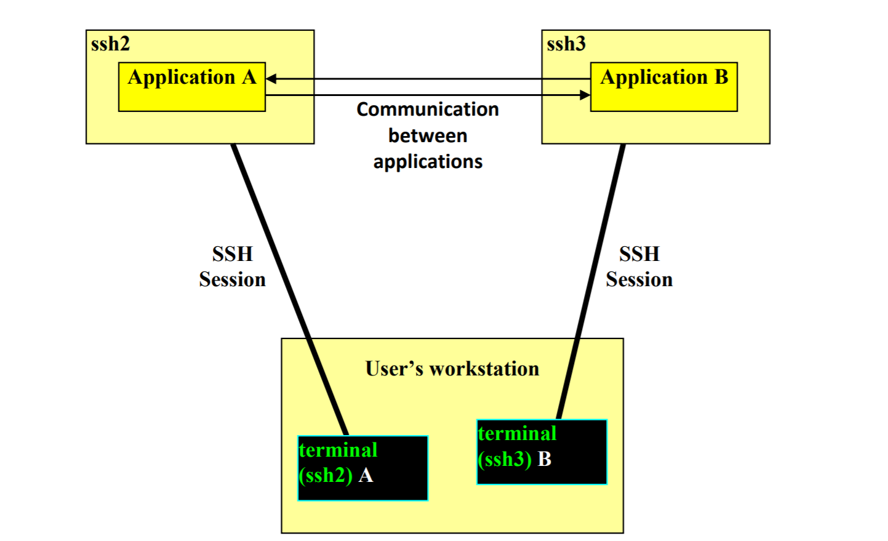

# Resumo das TPs e PLs de RCOMP

## 1. Establishing a TCP Connection
With TCP connection, several benefits arise:
- data is sent through the connection in a continuous flow, as if writing to a file or to a pipe, though unlike pipes a TCP connection is full-duplex.
- data delivery is guaranteed, TCP handles all transmission problems retransmitting any lost data whenever required.
- each byte of data is delivered in the same order it’s supplied.

As part of the client-server model, the client takes the initiative on contacting
the server. Thus, applying this model to TCP, results in being the TCP client
application the one taking the initiative of requesting a TCP connection
establishment with TCP server application.

In Java language, a TCP client application establishes a TCP connection with a
TCP server application by instantiating a Socket class object with the following
constructor method:

        public Socket(InetAddress address, int port) throws IOException

Where address is an InetAddress class object holding the server’s node IP
address, and port is the local port number where the server application is
receiving TCP connections. This method will raise an exception if the
connection establishment fails. On success, the socket is then connected to the server application.

Listening for TCP connection requests doesn’t mean accepting them. A TCP
connection is established only after being accepted by the server application.
For that purpose, the TCP server application has to call the accept() method, defined by the ServerSocket class, in Java.

        public Socket accept() throws IOException

First, the accept() method is blocking, if there’s no pending connection request to be accepted the process/thread blocks until one arrives, second, in the case of success they create and return a new socket connected to the client, this new socket represents the server-side of the established TCP connection with the client.
 
TCP servers always end up with several sockets (one for incoming connection requests and several others already connected to clients) so the more widely used strategy is creating a parallel subtask for each socket. In Java we will be using threads.

**Another Possible strategy is Polling:** for asynchronous events in a set of sockets, we can set a low read
timeout in all sockets. Then we can implement a polling cycle, repeatedly
trying the read/receive on each of them. In the case of failure we skip to the
next socket, otherwise we process the received data.

 

---
## 2. Using Threads 

* Extend Thread Class then call start() from the super class.

or

* Implement runnable on a specific class. Create an instance of Thread class, passing the runnable on the Thread constructor, and then call the start() method.

 

### Example:

        public class AttendClient implements Runnable {
            private Socket cliSock;
            public AttendClient(Socket s) { cliSock=s;}
            public void run() {         // the thread execution starts here
                // process client requests on cliSock
                cliSock.close();
            }                        // the thread execution ends here
        }
        
        - - - - - - - - - - - - - - - - - - - 

        public class TcpServer {
            public static void Main(String args[]) {
                static ServerSocket sock = new ServerSocket(9999);
                static Socket nSock;
                while(true) {
                    nSock=sock.accept();        // wait for a new connection
                    Thread cliConn = new Thread(new AttendClient(nSock));
                cliConn.start();          // start running the thread
                }
            }
        }

- - -

 

## 3. Data Transfer throught the TCP Connection

Data transfer through TCP connections can be directly read and written, and TCP ensures they flow efficiently and reliably. However, a byte granularity synchronization is essential, the number of bytes written in one side must exactly match the number of bytes being read on the counterpart. This requires a careful application protocol design ensuring applications always know exactly how many bytes they are supposed to read.

In Java language, reading and writing operations can’t be directly performed
over sockets, for reading the socket’s InputStream must be used, for writing
the socket’s OutputStream must be used. In the Socket class there are
methods available to get such streams:

        public OutputStream getOutputStream() throws IOException
            void write(int b) throws IOException
            void write(byte[] b, int off, int len) throws IOException
        public InputStream getInputStream() throws IOException
            int read() throws IOException
            int read(byte[] b, int off, int len) throws IOException

Use example:

        DataOutputStream sOut = new DataOutputStream(sock.getOutputStream());
        DataInputStream sIn = new DataInputStream(sock.getInputStream());

When developing network applications, the way they communicate with each other should not be dependent
on the programming language, neither on the underling operating system.

In addition to timing issues (synchronization), one key factor to ensure the success of communication through
an application protocol is specifying accurately the formats for exchanged data, and that must be
implementation independent. 

(For instance, when exchanging an integer number between two applications, sending the memory bytes
where the integer is stored in the local system, is unacceptable. The way data is stored, depends on the
operating system and platform, thus, sending data as it’s stored in the source node will very likely lead to
misinterpretation on the destination node.)

One of the simplest solution for abstract data transfer is representing data as human legible text, this is
because that’s a concept that exists and it’s supported on every system.

In TCP, synchronisation is a key feature to be settled by the application protocol, for the required byte level

synchronisation on TCP connections, three approaches can be used:

a) Use a pre-agreed fixed number of bytes in each transaction, this way the reader always knows how
many bytes it should read.

b) Before sending the data itself, send information about the number of bytes the data is made of. The
reader starts by getting the data length, then it knows how many data bytes it should read next. This
solution is used in HTTP protocol, where the message header has a Content-Length field indicating

c) Use a specific pre-agreed byte (or bytes sequence) as an end-of-data marker. Thus, the receiver must
then read one byte at a time, and check if it’s the end-of-data marker. This solution is also used in
helpdesk.app.portalUtilizador.httpServer.HTTP, the CR+LF sequence is used to mark the end of each header’s line, also, the CR+LF+CR+LF
sequence (an empty line) is used to mark the header’s end.

This last alternative is easy to implement if data is made of a limited set of possible byte values, like with
ASCII text. If data bytes are allowed to have any value, additional processing will be required, namely, any
mark value occurring in data will have to be masked on the sender and unmasked on the receiver to avoid
being wrongly interpreted.

 

---

## Using DEI LABS servers

A single network is shared by all DEI laboratories (LABS) (including the 6 servers bellow), it’s a private network supporting both IPv4:
10.8.0.0/16 and IPv6: fd1e:2bae:c6fd:1008::/64.

**Available servers for student use:**

| Public DNS name for SSH access | IPv4 address (DEI LABS) | IPv6 address (DEI LABS) |
| ---- | ---- | ----- |
| ssh1.dei.isep.ipp.pt (vsrv24.dei.isep.ipp.pt) | 10.8.0.80 | fd1e:2bae:c6fd:1008::80 |
| ssh2.dei.isep.ipp.pt (vsrv25.dei.isep.ipp.pt) | 10.8.0.81 | fd1e:2bae:c6fd:1008::81 |
| ssh3.dei.isep.ipp.pt (vsrv26.dei.isep.ipp.pt) | 10.8.0.82 | fd1e:2bae:c6fd:1008::82 |
| ssh4.dei.isep.ipp.pt (vsrv27.dei.isep.ipp.pt) | 10.8.0.83 | fd1e:2bae:c6fd:1008::83 |
| ssh5.dei.isep.ipp.pt (vsrv28.dei.isep.ipp.pt) | 10.8.0.84 | fd1e:2bae:c6fd:1008::84 |
| ssh6.dei.isep.ipp.pt (vsrv29.dei.isep.ipp.pt) | 10.8.0.85 | fd1e:2bae:c6fd:1008::85 |

For instance, with the purpose of testing two network applications A and B which communicate with each
other, they should be run at different servers, for instance, running application A at ssh2 and running
application B at ssh3.

 

---

## DEI Virtual Servers Cloud

Complementary environment - DEI Virtual Servers Cloud

In addition to the so far described working environment (DEI provided SSH Linux servers, and users’ personal
workstations, both connected to the DEI LABS network), it worth’s to be mentioned, there’s an additional
deployment environment that may be used.

The Virtual Servers Cloud infrastructure, provided by DEI, allows DEI users to create and manage servers,
assuming the administrator role of created servers. Notice that in DEI provided SSH Linux servers mentioned
before, users don´t have administrative privileges, for instance they can’t use TCP or UDP port numbers
bellow 1024.

This experimental environment operates over a cluster of servers, for now it has a single access frontend:
https://vs-ctl.dei.isep.ipp.pt/

It’s available within DEI networks only (a VPN connection to DEI is required). It will not be used in RCOMP
laboratory classes’ practical activities, but it could be used in the project. One most important feature for
servers that is provided, is each having a unique static IP address in network 10.9.0.0/16 (VNET1). Routing
between this network and the LABS network (10.8.0.0/16) is guaranteed.

---

 

## Example of an application protocol form PL10

"Create a TCP client and a TCP server with the following applications features and application protocol
specification: 

- The server IP address (IPv4, IPv6 or DNS name) is provided to the client as the first argument at the
command line.
- Once connected, the client sends a list of integer numbers terminated with the zero value.
- The server accepts TCP connections from clients. For logging, each new connection and disconnection
should be presented at the server console, showing the client IP address and port number.
- The server calculates the sum of the sent integers and sends back the result.
- When the client wants to exit it should send an empty list (started by the zero value).
- Each integer is sent as a sequence of 4 bytes in order of increasing significance, i.e. first the LSB (Least
Significant Byte) and last the MSB (Most Significant Byte).
13/17
Instituto Superior de Engenharia do Porto (ISEP) – Licenciatura em Engenharia Informática (LEI) – Redes de Computadores (RCOMP) – André Moreira (ASC)
So, the sequence of bytes A, B, C, D represents the number given by:
NUMBER = A + 256xB + 256x256xC + 256x256x256xD
For instance:
The number 10 is sent as the sequence of bytes: 10, 0, 0, 0
The number 300 is sent as the sequence of bytes: 44, 1, 0, 0 "

This might look an odd way of sending an integer number. The problem is, directly sending integer numbers as they are stored in the local host’s memory is not an option because they can be stored differently in the
source host and destination host, for instance when a Java client is sending to a C server.
Of course, one other often used option to send data in an implementation independent representation, is by sending the humanly readable representation of data. This application protocol could specify that each
integer is sent in the form of its text representation.
This is a good option because all programming APIs have function to parse most data types from textual representations into local storing and also functions to produce textual representations from local storing.

<!--

Another example:

The client application:
- Requests the user to define a nickname.
- Establishes a TCP connection with the server indicated by the command line’s first argument.
- While the user doesn’t type anything on the console keyboard, the client keeps printing text lines received from the server (listen mode).
- If the user types something on the console keyboard, reads a line from the keyboard to be sent to the server.
The line sent to the server is prefixed with the nickname in brackets, to identify the user. Then the client goes
back to listening mode.
- To end the session the user should type “exit”, then the client application will send an empty line to the server, which in turn will also reply with an empty line. The client application can then close the connection and exit.

The server application:
- Accepts new clients TCP connections.
- On already established TCP connections (connected clients), receives text lines, following the described protocol.
- If the received text line is empty (receives byte zero),replies back with an empty line, and closes that client’s TCP connection.
- Otherwise, retransmits the line (writes it) on all existing connections (including the client who sent it in the
first place).

-->

---

 