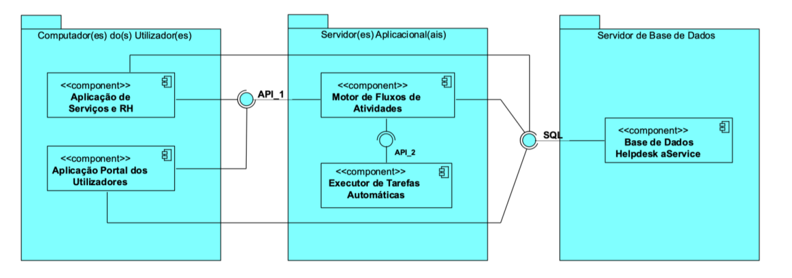

# US4002 - Comunicação com o Motor de Fluxo de Atividade
=======================================

# 1. Requisitos

**User Story:**
Como Gestor de Projeto, eu pretendo que o Motor de Fluxo de Atividades disponibilize, a pedido, os dados necessários às aplicações "Serviços e RH" e "Portal dos Utilizadores".

**Critérios de aceitação:**
Deve ser usado o protocolo de aplicação fornecido (SDP2021). 
Deve ser suportado o processamento simultaneo de pedidos.
Sugere-se que desde já seja considerada a adoção de mecanismos concorrente (e.g. threads) e partilha de estado entre esses mecanismos.
Neste sprint, para efeitos de demonstração, é aceitável que o processamento associado a algumas destas comunicações seja apenas simulado (mock). 

  

Na interpretação feita dos requisitos necessários para satisfazer esta user story identificaram-se dois pontos cruciais:
- Definir o protocolo de aplicação a ser usado nas comunicações entre as diferentes aplicações. (Comum com as User Stories 4001, 5001 e 2011)
- Implementar este protocolo, bem como as classes de apoio necessárias, para a transação da informação entre as aplicações do sistema:

    A. Aplicação Portal de Utilizadores <---> Motor de Fluxo de Atividade

    B. Aplicação Serviços e RH <---> Motor de Fluxo de Atividade

    C. Motor de Fluxo de Atividade <---> Executor de Tarefas Automáticas (Implementação realizada na [US5001](<../5001 - Executor Tarefas Automaticas/US5001 - Executor Tarefas Automaticas>) )

 

# 2. Análise

Estas transações de informação entre as aplicações serão realizadas através de uma ligação TCP (Transmission Control Protocol), estabelecida segundo o modelo cliente-servidor.

A aplicação Portal de utilizador e a aplicação serviços e RH exercerão o papel de aplicação cliente face à aplicação motor fluxo de atividades enquanto que esta exercerá o papel de aplicação servidora.

Por outro lado, a aplicação executor de Tarefas Automáticas exercerá o papel de aplicação servidora em relação com a aplicação motor de fluxo de atividades, que fará, neste caso, o papel de aplicação cliente.

Assim, cabe:

- à aplicação cliente tomar a iniciativa de solicitar o estabelecimento da ligação TCP com a aplicação servidora;
- à aplicação servidora aceitar pedidos de ligação TCP no porto definido.

Depois de estabelecida a ligação TCP cabe:

- à aplicação cliente manter a iniciativa da comunicação, sendo a única que pode enviar mensagens de pedido;
- à aplicação servidora enviar mensagens de resposta aos pedidos recebidos.

 
 

### 2.1 Persistência das ligações entre aplicações

Quanto á persistência das ligações, temos dois requisitos distintos:

* Serviços e RH/Portal de Utilizador <--->Motor de fluxo de Atividades

    As ligações TCP devem persistir e ser utilizadas para sucessivas transações enquanto a aplicação cliente estiver em execução. Caso a ligação TCP entre o cliente e o servidor se tornar inoperante, cabe ao cliente estabelecer de forma automática e sem intervenção humana uma nova ligação com o mesmo servidor

* Motor de fluxo de Atividades <---> Executor de Tarefas Automáticas

    A ligação TCP deve persistir apenas durante a execução de cada tarefa automática. Uma vez terminada a execução da tarefa, algo que deverá implicar a devolução de um feedback ao cliente, o cliente deve solicitar o fim da ligação.

 
 

### 2.2 Processamento simultaneo de pedidos

Por último é necessário ter em conta que o sistema deve suportar o processamento de diferentes pedidos, válidos ou não, em simultâneo, sem estar pendente ou causar demoras ao tratamento de pedidos anteriores.

  

# 3. Design

## **3.1. Protocolo de Aplicação**

A comunicaçõa será efetuada com recurso a utilização de sockets e transmissão de mensagens com uma sequência de bytes respeitando o "formato geral da mensagem" apresentando a seguir. Sendo que a informação contida na secção "Dados" será representada através de texto codificado em UTF-8.

Tal como requisitado, a(s) aplicação(ões) que desempenha(m) o papel de aplicação servidora aceitará pedidos no **porto número 32057**. Contudo optamos por tornar esta opção configurável, juntamente com o IP do servidor, a partir do ficheiro de configuraçãoes.

De modo a resolver o requisito do processamento simultaneo de pedidos, a aplicação servidora recorrerá à criação de uma nova *Thread* para o processamento de cada novo pedido, enquanto que o processo principal permanecerá continuamente à escuta de novas ligações.

 

### **3.1.1. Formato Geral da Mensagem**

Cada pedido ou resposta consistirá no envio de uma sequência de bytes segundo o formato geral de mensagem descrito na tabela seguinte:

| Designação do campo | Posição (bytes) | Comprimento (bytes) | Descrição |
| ----- | --- | ---- | ---- |
| Versão | 0 | 1 | Versão do protocolo SDP2021. Este campo é constituído por um único byte e deve ser interpretado com um número inteiro positivo (0 a 255). A versão do protocolo é usada para garantir a compatibilidade entre as aplicações, a primeira versão deverá ser a versão zero. |
| Código | 1 | 1 |Código que identifica o tipo de pedido ou o tipo de resposta. Este campo é constituído por um único byte e deve ser interpretado com um número inteiro positivo (0 a 255). |
|Número de bytes | 2 | 1 | Número de bytes transportados no campo “Dados”. Este campo é constituído por um único byte e deve ser interpretado com um número inteiro positivo (0 a 255). Caso contenha o valor zero, significa que o campo “Dados” não existe/é vazio. |
| Dados | 3 | Variável | Dados para serem manuseados pelas aplicações finais. O comprimento deste campo, em bytes, é definido pelo campo anterior. |

  

### **3.1.2. Códigos de pedido/resposta**

O campo "Código" será preenchido de acordo com o pedido/resposta a solicitar/comunicar. Os códigos de mensagens com valores/ definidos até ao momento são:

| Código | Significado/Utilização | 
| ------ | ---------------------- | 
| 0 | **Teste** - Pedido de teste sem qualquer efeito para além da devolução de uma resposta com código 2. Este pedido não transporta dados.|
| 1 | **Fim** - Pedido de fim de ligação. O servidor deve devolver uma resposta com código 2, após o que ambas as aplicações devem fechar a ligação TCP.|
| 2 | **Entendido** - Resposta vazia (não transporta dados) que acusa a receção de um pedido. É enviada em resposta a pedidos com código 0 e código 1, mas poderá ser usada em outros contextos.|
| 3 | **Realizado com Sucesso** - Resposta tipica para comunicar a realização com sucesso de uma operação |
| 4 | **Erro ao realizar pedido** - Mensagem recebida e interpretada corretamente mas surgiu um erro (não previsto noutro código de erro) ao realizar o pedido e este não pôde ser terminado. Contém mensagem de erro.
| 5 | **Mensagem não reconhecida** - O servidor não consegue interpretar a mensagem recebida|
| 6 | **Código inválido** - Mensagem de erro quando o código especificado é inválido ou não está definido|
| 7 | **Erro de formatação** - Formato geral da mensagem é válido e foi lido corretamente mas o conteudo do campo "dados" está mal definido/formatado |
| 8 | **Erro de conteúdo** - Formato geral da mensagem e conteúdo interpretado corretamente mas os dados fornecidos não são válidos ou não foram encontradas correspondências |
| 9 | **Erro de servidor** -  |
| ... | (outras mensagens de erro a definir posteriormente) |
| 50 | **Pedido Submetido**  - Notificação que informa o motor de fluxos da criação/solicitação de um novo pedido |
| 51 | **Estado de um Pedido** - Solicitação, ao motor de fluxos de atividade, do estado de um pedido especifico |
| 52 | **Resposta Estado Pedido** - resposta, por parte do motor de fluxos de atividade, contendo o estado do pedido solicitado (com o código 31) |
| 53 | **Informação de Tarefas** - Solicitação, do portal de utilizador ao motor de fluxo de atividade, da informação necessária a demonstrar no dashboard HTML |
| 54 | **Resposta Informação de Tarefa** - Resposta, por parte do motor de fluxos, contendo a informação solicitada no pedido 33
| 55 | **Tarefa Concluída** - Comunicação ao motor de fluxo de atividades que uma tarefa manual especifica foi realizada (seja ou aprovada|
| 56 |  **Realizar Tarefa Automática** - Solicitação, do motor de fluxo de atividade ao executor de tarefas automáticas, para executar uma tarefa especifiaca |
| 57 |  **Dados para Realização da Tarefa** - Comunica ao motor de fluxos informação necessária para a realização de uma tarefa automática (variaveis utilizadas no script de realização) |
| 58 |  **Feedback Realizacao da Tarefa Automática** - Caso seja necessário devolver uma resposta/feedback especifico sobre a tarefa automática realizada |
| 59 |  **Estado do Executor Tarefas** - Solicitação,ao executor de tarefas sobre o seu estado de carga e/ou número de tarefas a executar |
| ... | (outros códigos cujo significado/utilização são definidos pela equipa de desenvolvimento)
| 255 | **Segmento** - identifica os dados transportados como sendo uma parte de um conjunto de dados mais extenso. Este código é usado para transferir volumes de dados superiores a 255 bytes. Nesse cenário um pedido ou uma resposta pode ser constituído por uma sequência de mensagens com código 255 finalizada por uma mensagem contendo um código diferente de 255.|

 

    Exemplo de utilzação do código 255:

    Para enviar um pedido ou resposta com código XXX transportando um conteúdo de 400 bytes:
    - 1º - É enviada uma mensagem com código 255 contendo os primeiros 255 bytes.
    - 2º - É enviada uma mensagem com código XXX contendo os restantes 145 bytes. 

### **3.1.3. Contéudo/Estrutura das mensagens**

Cada mensagem apresentará uma estrutura definida para o conteúdo do campo  "dados" sendo terminada com o caracter "\n".

[] - valores opcionais

 

0 - Teste 

        Não transporta dados ou o conteúdo é ignorado

1 - Fim

        Não transporta dados ou o conteúdo é ignorado

2 - Entendido

        Não transporta dados ou o conteúdo é ignorado

3 - Realizado com Sucesso

        Não transporta dados ou o conteúdo é ignorado

4 - Erro ao realizar pedido

        «Mensagem recebida» ; [«descrição do erro»]

5 - Mensagem não reconhecida

        «Mensagem recebida» ; [«descrição do erro»]

6 - Código Inválido

        «Mensagem recebida» ; [«descrição do erro»]

7 - Erro de Formatação

        «Mensagem recebida» ; [«descrição do erro»]

8 - Erro de conteúdo

       «Mensagem recebida» ; [«descrição do erro»]

9 - Erro de servidor

       «Mensagem recebida» ; [«descrição do erro»]

- - - 

50 - Novo Pedido Solicitado

        «Identificador do Pedido criado»

51 - Estado de um Pedido

        «Identificador do Pedido»

52 - Resposta Estado do Pedido

        «Identificador do Pedido»; «Estado do Pedido»

53 - Informação da Tarefa

        «Codigo da Tarefa»

54 - Resposta Informação de Tarefa

<<<<<<<<<<<<<<<<<<<<<<<<< A DEFINIR>>>>>>>>>>>>>>>>>>>>>>>>>

55 - Tarefa Concluída

        «CodigoTarefa»

<!-- 56 - Resposta Tarefa Concluída
        «CodigoTarefa» «Estado atual do Pedido» -->

56 - Realizar Tarefa Automática

        «CodigoTarefa» «Script da Tarefa» 

57 - Dados para Realizacao

        «codigoTarefa» «Nome da Variável» «valor da variavel»

58 - Feedback Realizacao Tarefa Automática

        «CodigoTarefa» «resultado/feedback»

59 - Estado Executor Tarefas
<<<<<<<<<<<<<<<<<<<<<<<<< A DEFINIR>>>>>>>>>>>>>>>>>>>>>>>>>

 
 
 
 
 

# 3. Design

## 3.4. Testes 

**Teste 1:** Verificar que a mensagem enviada/recebida apresenta a estrutura correta [versão, código, tamanho, dados]

**Teste 2:** Verificar que uma mensagem com conteudo superior a 255 bytes é em duas(ou mais) mensagens.

**Teste 3:** Verificar que uma mensagem (enviada em vários segmentos) tem código 255 excepto no ultimo segmento.

