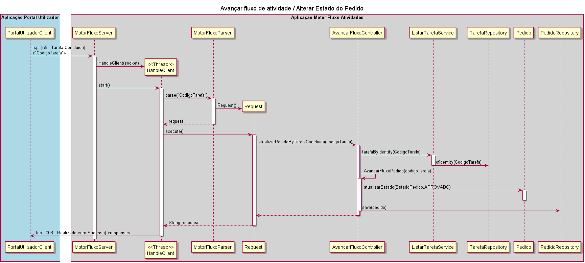

# US4003 - Concluir desenvolvimento do Motor de Fluxo de Atividades
=======================================

# 1. Requisitos

**User Story:**
Como Gestor de Projeto, eu pretendo que a equipa conclua o desenvolvimento do motor de fluxos de atividades tornando-o bastante robusto.

**Critérios de aceitação:**

Refinar US 4001 e US 4002.

- Critérios US4001:

	- No caso do Motor de Fluxo de Atividade encontrar uma atividade automática, este deve solicitar e monitorizar a sua execução no Executor de Tarefas Automáticas. Para tal, deve ser usado o protocolo de aplicação fornecido (SDP2021). 

- Critérios US4002:
	- Deve ser usado o protocolo de aplicação fornecido (SDP2021). 
	- Deve ser suportado o processamento simultaneo de pedidos.

	- Sugere-se que desde já seja considerada a adoção de mecanismos concorrente (e.g. threads) e partilha de estado entre esses mecanismos.

	- Neste sprint, para efeitos de demonstração, é aceitável que o processamento associado a algumas destas comunicações seja apenas simulado (mock). 

 

# 2. Análise

[Consultar documentação da user story 4001](../../Sprint%20C/4001%20-%20Motor%20de%20Fluxo%20de%20Atividades/US4001%20-%20Motor%20de%20Fluxo%20de%20Atividades.md)

[Consultar documentação da user story 4002](../../Sprint%20C/4002%20-%20Comunicação%20com%20o%20Motor%20de%20Fluxo%20Atividades/US4002%20-%20Comunicação%20com%20o%20motor%20de%20fluxo.md)

* Onde Colocar a lógica relacionada com avançar estado do pedido?

* Onde Colocar a lógica relacionada com avançar estado da tarefa?

* Se/quando temos que lidar com dois agregaddos, deviamos usar um service?

* Podemos pedir info pedido->serviço->atividade p.e.? Ou deviamos, no service pedir o serviço ao pedido e depois ir buscar este pedido e pedir-lhe/alterar coisas e gravar, e voltar a lidar com o pedido ??

 

# 3. Design

## 3.1. Modelo Domínio

Excerto relevante do Modelo de Dominio:

 

## 3.2. Realização da Funcionalidade

### 3.2.1 Criação de Tarefas de um novo Pedido

 

### 3.2.2. Actualização de estado do pedido após realização de uma Tarefa

 

### 3.2.3. Delegação de uma Tarefa Automática para o Executor de Tarefas Automáticas

Extremamente similar ao ponto anterior (3.1.2), exeptuando o fato da Tarefa ter sido realizada no executor de Tarefas Automáticas, logo a alteração do estado da Tarefa também será feita no Motor de Fluxo de Atividades, e não no Portal de Utilizador.

 

### 3.2.4. Disponibilização do estado dos Pedidos e de informações sobre a realização de Tarefas

À semelhança dos exemplos anteriores, utilizando o protocolo de comunicação estabelecido,podemo solicitar ao motor de fluxo de atividades:
- informação sobre o estado de um pedido: [051 - Estado de um Pedido] «codigoPedido»
- informação detalhada sobre uma Tarefa: [053 - Informação da Tarefa] «codigoTarefa»
- uma lista de Tarefas Pendentes acessiveis a um colaborador : [058 - Lista Tarefas Pendentes] «NrMecanografico do Colaborador»

Consultar o Protocolo de Comunicação e a US4002 parainformação mais detalhada.

 

## 3.3. Padrões e Princípios Aplicados

*Nesta secção deve apresentar e explicar quais e como foram os padrões de design aplicados e as melhores práticas.*

## 3.4. Testes 

**Teste 1:** Verificar que a tarefa não pode ser criada sem estar associada a um Pedido.

**Teste 2:** Verificar que a tarefa é criada em estado pendente.

**Teste 4:** Verificar que, ao solicitar um pedido com uma tarefa de realização automática (e sem tarefa de aprovação), esta é resolvida automaticamente e o estado do Pedido é atualizado para concluído.

